# High-Level Design (HLD) - Todo Management Application

**Version:** 1.0  
**Date:** November 10, 2025  
**Status:** Draft

---

## 1. Overview

This document describes the high-level architecture, API design, and database schema for the Todo Management Application - a backend-focused, single-user task management system with automatic overdue tracking and comprehensive filtering capabilities.

---

## 2. Architecture

### 2.1 System Context

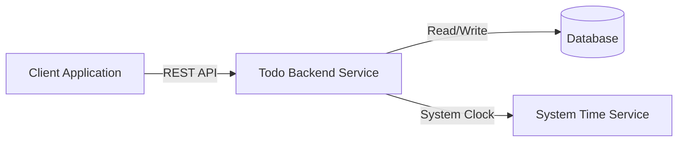

### 2.2 Component Architecture

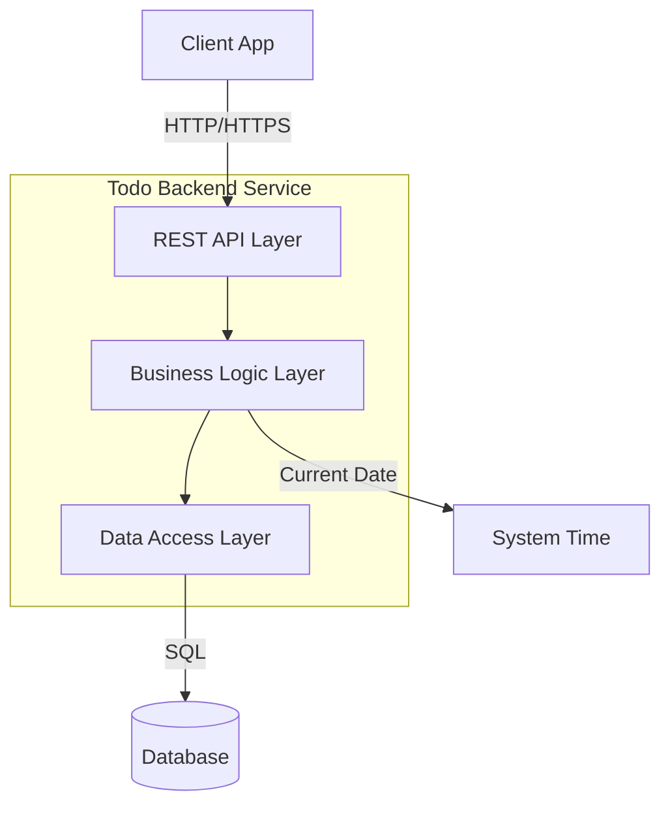

### 2.3 Component Responsibilities

| Component | Responsibility |
|-----------|---------------|
| **REST API Layer** | Request validation, routing, response formatting, error handling |
| **Business Logic Layer** | Business rules, status calculation, filtering logic, bulk operations coordination |
| **Data Access Layer** | CRUD operations, query building, transaction management |
| **Database** | Persistent storage of todo entities |
| **System Time** | Provides current date for overdue calculation |

### 2.4 Key Design Decisions

1. **Stateless Service**: Backend is stateless; all state stored in database
2. **Calculated Status**: Status "due" is computed on-read, never stored
3. **Atomic Bulk Operations**: Use database transactions for all-or-nothing semantics
4. **Last-Write-Wins**: No optimistic locking; concurrent updates resolved by timestamp
5. **Single Tenant**: No user context; all todos belong to implicit single user

---

## 3. API Design

### 3.1 API Overview

**Protocol**: REST over HTTP/HTTPS  
**Data Format**: JSON  
**Base Path**: `/api/v1`

### 3.2 API Endpoints

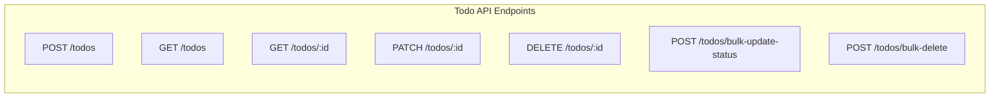

### 3.3 Endpoint Specifications

#### 3.3.1 Create Todo
```
POST /api/v1/todos
```

**Request Body**:
- `title` (required): string, max 100 chars
- `description` (optional): string, max 1000 chars
- `dueDate` (optional): string, YYYY-MM-DD format, cannot be past
- `priority` (optional): enum ["low", "medium", "high", "urgent"], defaults to "medium"

**Response** (201 Created):
- Complete todo object with generated `id`, `createdAt`, `modifiedAt`
- Status set to `initial`

**Errors**:
- 400: Validation error (field-specific)

---

#### 3.3.2 Get Todo by ID
```
GET /api/v1/todos/:id
```

**Path Parameters**:
- `id` (required): UUID

**Response** (200 OK):
- Complete todo object with calculated status

**Errors**:
- 404: Todo not found

---

#### 3.3.3 List and Filter Todos
```
GET /api/v1/todos
```

**Query Parameters** (all optional):
- `status.equals`: enum ["initial", "complete", "due"]
- `status.notEquals`: enum ["initial", "complete", "due"]
- `priority.equals`: enum ["low", "medium", "high", "urgent"]
- `priority.notEquals`: enum ["low", "medium", "high", "urgent"]
- `dueDate.before`: string, YYYY-MM-DD
- `dueDate.after`: string, YYYY-MM-DD
- `dueDate.notBefore`: string, YYYY-MM-DD
- `dueDate.notAfter`: string, YYYY-MM-DD
- `title.contains`: string, case-insensitive
- `title.notContains`: string, case-insensitive
- `description.contains`: string, case-insensitive
- `description.notContains`: string, case-insensitive

**Filter Logic**: AND combination of all provided filters

**Response** (200 OK):
- Array of todo objects with calculated status

**Errors**:
- 400: Invalid filter parameters (field-specific)

---

#### 3.3.4 Update Todo
```
PATCH /api/v1/todos/:id
```

**Path Parameters**:
- `id` (required): UUID

**Request Body** (all optional, partial update):
- `title`: string, max 100 chars
- `description`: string, max 1000 chars, or null to clear
- `dueDate`: string, YYYY-MM-DD, or null to clear, cannot be past
- `status`: enum ["initial", "complete"], cannot be "due"
- `priority`: enum ["low", "medium", "high", "urgent"]

**Response** (200 OK):
- Updated todo object with calculated status

**Errors**:
- 400: Validation error or invalid status transition
- 404: Todo not found

---

#### 3.3.5 Delete Todo
```
DELETE /api/v1/todos/:id
```

**Path Parameters**:
- `id` (required): UUID

**Response** (204 No Content):
- Empty body

**Errors**:
- 404: Todo not found

---

#### 3.3.6 Bulk Update Status
```
POST /api/v1/todos/bulk-update-status
```

**Request Body**:
- `ids` (required): array of UUIDs, max 100 items
- `status` (required): enum ["initial", "complete"]

**Response** (200 OK):
- Array of updated todo objects with calculated status

**Errors**:
- 400: Validation error, invalid transition, or exceeds max limit (atomic rollback)
- 404: Any todo not found (atomic rollback)

---

#### 3.3.7 Bulk Delete
```
POST /api/v1/todos/bulk-delete
```

**Request Body**:
- `ids` (required): array of UUIDs, max 100 items

**Response** (204 No Content):
- Empty body

**Errors**:
- 400: Exceeds max limit (atomic rollback)
- 404: Any todo not found (atomic rollback)

---

### 3.4 Response Formats

#### Success Response
```json
{
  "data": { /* todo object or array */ }
}
```

#### Error Response
```json
{
  "error": {
    "code": "VALIDATION_ERROR",
    "message": "Validation failed",
    "details": [
      {
        "field": "title",
        "message": "Title is required and must not exceed 100 characters"
      }
    ]
  }
}
```

### 3.5 Status Codes

| Code | Meaning | Usage |
|------|---------|-------|
| 200 | OK | Successful GET, PATCH, or bulk update |
| 201 | Created | Successful POST (create) |
| 204 | No Content | Successful DELETE |
| 400 | Bad Request | Validation error or business rule violation |
| 404 | Not Found | Todo not found |
| 500 | Internal Server Error | Unexpected server error |

---

## 4. Data Design

### 4.1 Database Schema

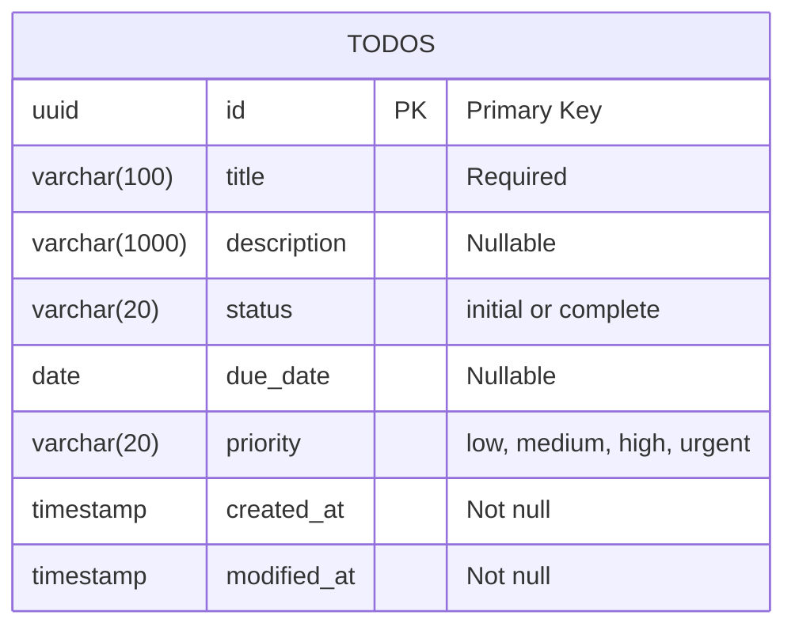

### 4.2 Table: `todos`

| Column | Type | Constraints | Description |
|--------|------|-------------|-------------|
| `id` | UUID | PRIMARY KEY, NOT NULL | System-generated unique identifier |
| `title` | VARCHAR(100) | NOT NULL | Todo title |
| `description` | VARCHAR(1000) | NULL | Optional detailed description |
| `status` | VARCHAR(20) | NOT NULL | Stored status: "initial" or "complete" |
| `due_date` | DATE | NULL | Optional deadline (date only) |
| `priority` | VARCHAR(20) | NOT NULL, DEFAULT 'medium' | Priority level |
| `created_at` | TIMESTAMP | NOT NULL | Creation timestamp (UTC) |
| `modified_at` | TIMESTAMP | NOT NULL | Last modification timestamp (UTC) |

### 4.3 Indexes

```sql
-- Primary key (automatically indexed)
PRIMARY KEY (id)

-- Query optimization for filtering
CREATE INDEX idx_status ON todos(status);
CREATE INDEX idx_priority ON todos(priority);
CREATE INDEX idx_due_date ON todos(due_date);
CREATE INDEX idx_created_at ON todos(created_at);
```

### 4.4 Constraints

- No uniqueness constraints on any field except primary key
- No foreign keys (single entity system)
- Check constraint: `status IN ('initial', 'complete')`
- Check constraint: `priority IN ('low', 'medium', 'high', 'urgent')`

---

## 5. Business Logic

### 5.1 Status Calculation Algorithm

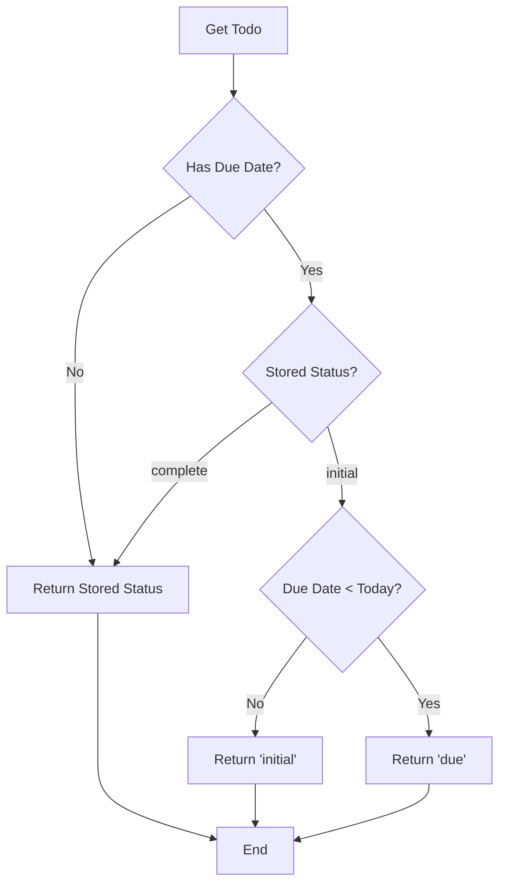

**Pseudocode**:
```
function calculateStatus(todo, currentDate):
    if todo.status == 'complete':
        return 'complete'
    
    if todo.dueDate == null:
        return todo.status  // 'initial'
    
    if currentDate > todo.dueDate and todo.status == 'initial':
        return 'due'
    
    return todo.status  // 'initial'
```

### 5.2 Status Transition Validation

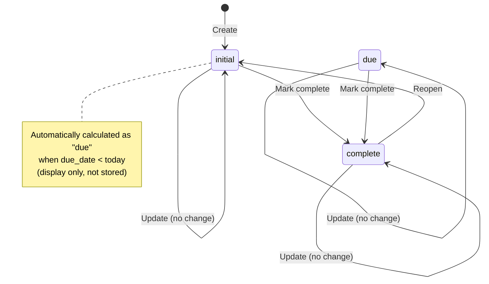

**Validation Rules**:
1. Can transition from `initial` to `complete`
2. Can transition from `complete` to `initial`
3. Can transition from calculated `due` to `complete`
4. **Cannot** transition from calculated `due` to `initial` if due date is in past
5. User can never manually set status to `due`

### 5.3 Filtering Logic

**Implementation**:
- All filters use AND logic (intersection of results)
- Status filters operate on calculated status, not stored status
- String filters (contains/notContains) are case-insensitive
- Date filters use standard date comparison
- Empty filter list returns all todos

### 5.4 Bulk Operations

**Transaction Flow**:
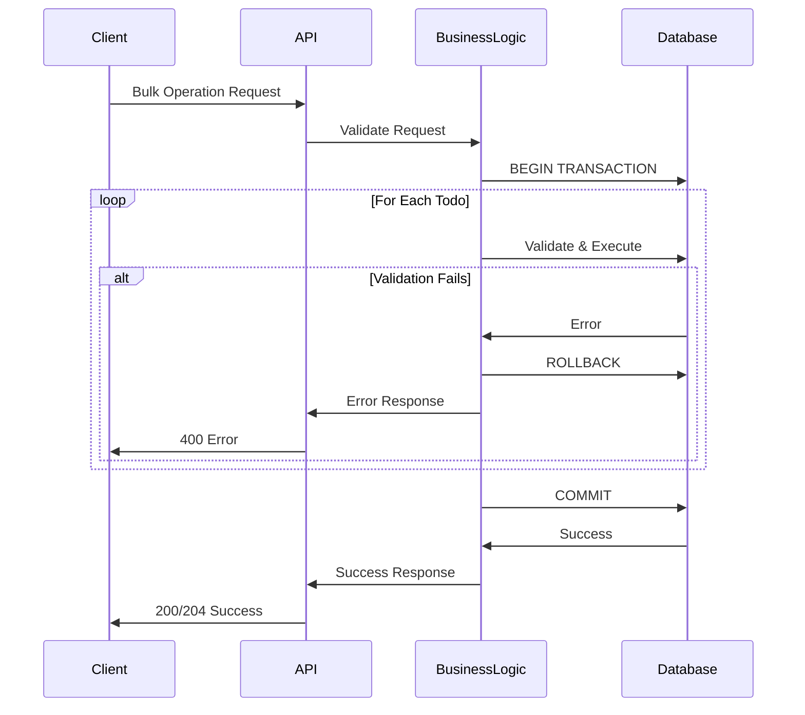

---

## 6. Data Flow

### 6.1 Create Todo Flow

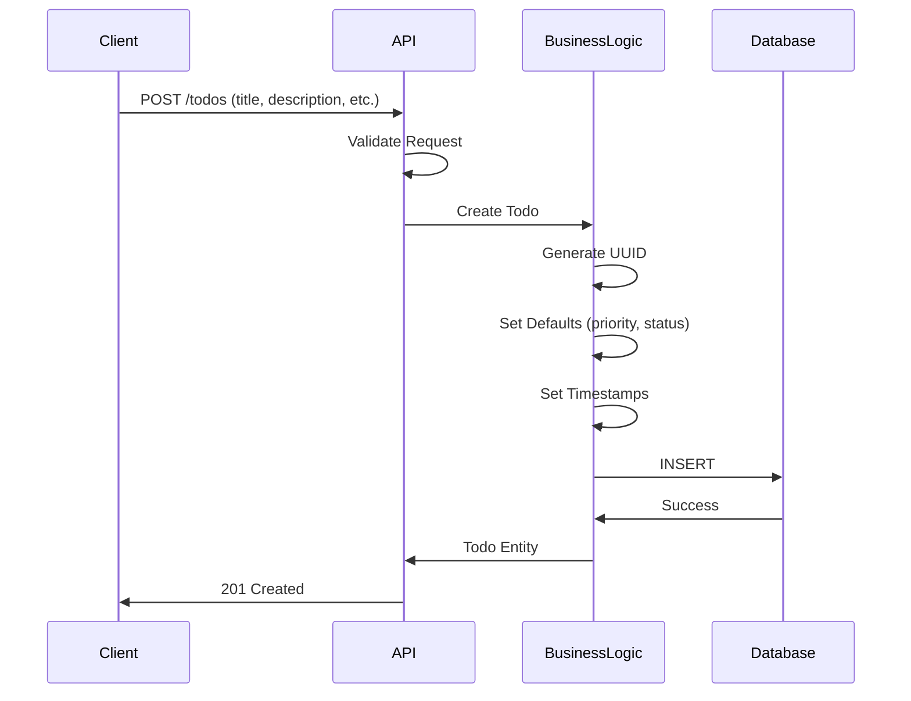

### 6.2 List with Filtering Flow

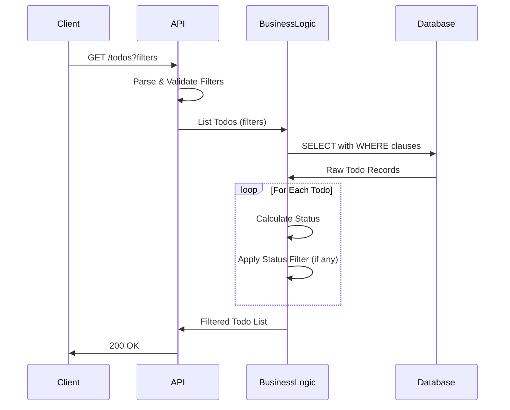

---

## 7. Non-Functional Requirements

### 7.1 Performance Targets

| Operation | Target Response Time |
|-----------|---------------------|
| Create Todo | < 100ms |
| Get Todo by ID | < 50ms |
| List/Filter Todos | < 200ms |
| Update Todo | < 100ms |
| Delete Todo | < 50ms |
| Bulk Operations | < 500ms (for 100 items) |

### 7.2 Scalability

- **Current**: Single-user system, optimized for < 10,000 todos
- **Database**: Standard relational database with indexed queries
- **Concurrency**: Last-write-wins, no locking overhead

### 7.3 Reliability

- **Atomicity**: Bulk operations use database transactions
- **Data Integrity**: Database constraints enforce valid states
- **Error Handling**: Graceful degradation with detailed error messages

### 7.4 Security Considerations

- **Current Scope**: No authentication/authorization (single-user)
- **Future**: Add authentication layer before API endpoints
- **Data Validation**: Strict input validation on all endpoints
- **Error Messages**: Field-specific errors (acceptable for single-user)

---

## 8. Technology Considerations

### 8.1 Recommended Stack

| Component | Recommendation |
|-----------|---------------|
| **Database** | PostgreSQL (UUID support, ACID compliance, JSON support for future) |
| **Alternative DB** | SQLite (simpler deployment), MySQL (wider adoption) |
| **API Framework** | Express.js (Node.js), FastAPI (Python), Spring Boot (Java) |
| **Validation** | Zod (TypeScript), Joi (JavaScript), Pydantic (Python) |
| **ORM** | Drizzle ORM, Prisma, TypeORM (TypeScript), SQLAlchemy (Python) |

### 8.2 Database Choice Comparison

| Feature | PostgreSQL | SQLite | MySQL |
|---------|-----------|--------|-------|
| **UUID Support** | Native | Extension | Native (8.0+) |
| **ACID Compliance** | Full | Full | Full |
| **Concurrency** | Excellent | Good (write-lock) | Excellent |
| **Deployment** | Server | File-based | Server |
| **Recommendation** | Best for production | Best for development | Alternative |

---

## 9. Deployment Architecture

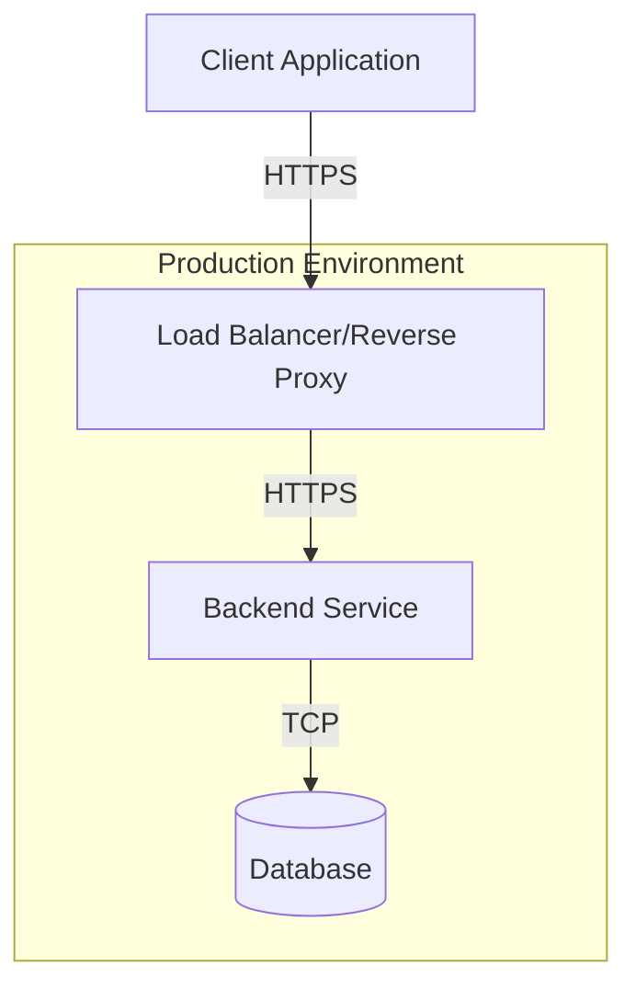

### 9.1 Deployment Components

| Component | Purpose | Scaling |
|-----------|---------|---------|
| **Load Balancer** | SSL termination, request routing | N/A (single user) |
| **Backend Service** | API processing | Single instance (stateless) |
| **Database** | Persistent storage | Single instance |

---

## 10. Future Architecture Evolution

### 10.1 Multi-User Support

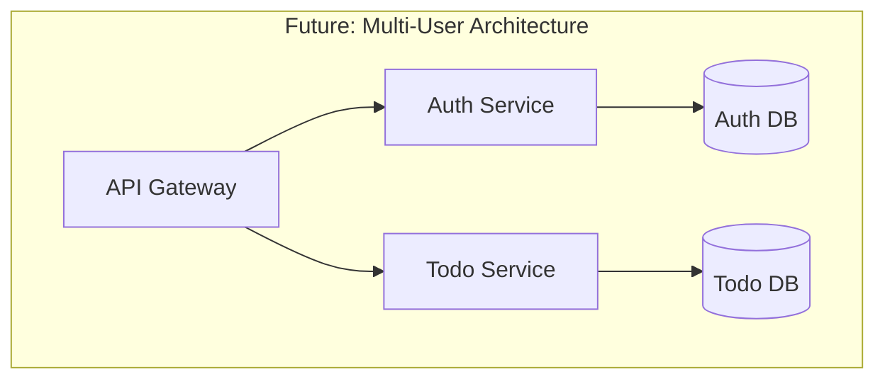

**Changes Required**:
- Add `user_id` column to `todos` table
- Implement authentication/authorization layer
- Add user management service
- Implement tenant isolation in queries

### 10.2 Pagination & Advanced Features

**Schema Changes**:
- Add soft delete: `deleted_at` column
- Add search optimization: Full-text search indexes
- Add audit trail: `todos_history` table

---

## 11. Open Design Questions

See `hld.clarification.md` for specific questions requiring product decisions.

---

## 12. Design Alternatives & Suggestions

See `hld.suggestions.md` for alternative approaches and optimization suggestions.

---

## Appendix A: Model References

- **API Models**: See `api-model.ts` for Zod validation schemas
- **Database Models**: See `db-model.ts` for TypeScript entity types

---

## Appendix B: Glossary

| Term | Definition |
|------|------------|
| **UUID** | Universally Unique Identifier (RFC 4122) |
| **ACID** | Atomicity, Consistency, Isolation, Durability |
| **REST** | Representational State Transfer |
| **ORM** | Object-Relational Mapping |
| **Last-Write-Wins** | Concurrency model where most recent write takes precedence |
| **Calculated Status** | Status computed on-demand, not stored in database |
| **Atomic Operation** | All-or-nothing operation (all succeed or all fail) |

---

**Document Status**: Ready for Review  
**Next Steps**: API implementation, database setup, integration testing

