# High-Level Design (HLD) - Todo Management Application

**Version:** 1.0  
**Date:** November 10, 2025  
**Status:** Draft

---

## 1. Overview

This document describes the high-level architecture, API design, and database schema for the Todo Management Application - a backend-focused, single-user task management system with automatic overdue tracking and comprehensive filtering capabilities.

---

## 2. Architecture

### 2.1 System Context

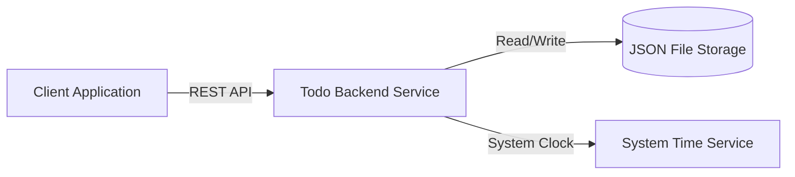

### 2.2 Component Architecture

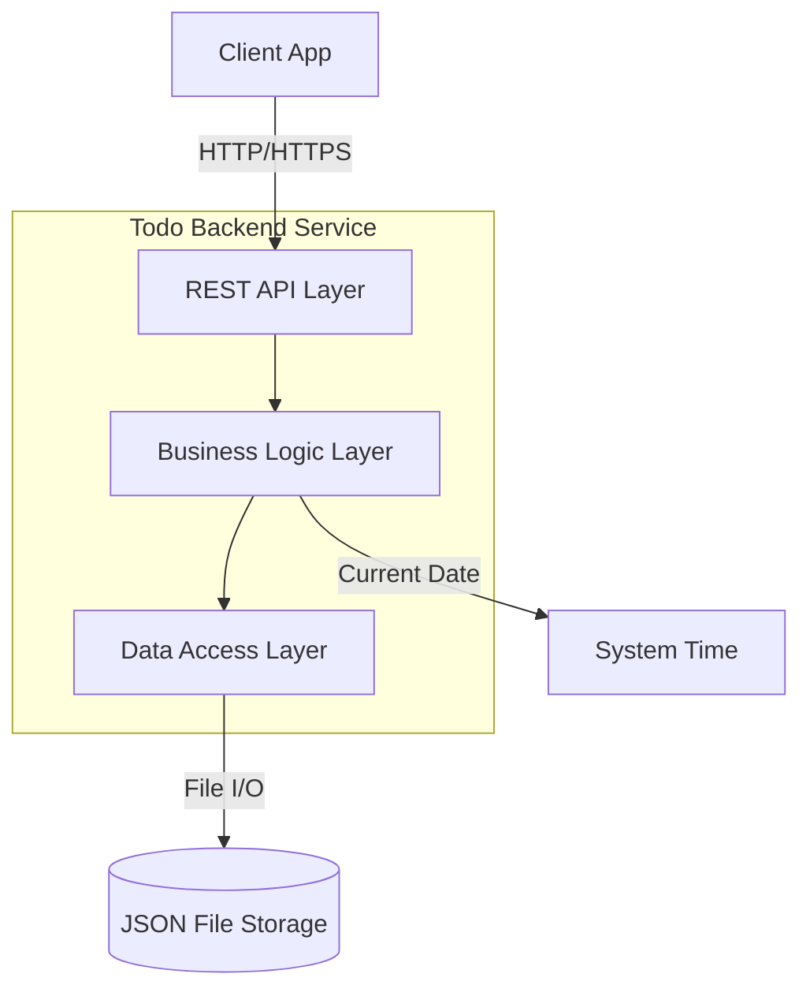

### 2.3 Component Responsibilities

| Component | Responsibility |
|-----------|---------------|
| **REST API Layer** | Request validation, routing, response formatting, error handling |
| **Business Logic Layer** | Business rules, status calculation, filtering logic, bulk operations coordination, conflict detection |
| **Data Access Layer** | CRUD operations, JSON file operations, atomic file updates, locking |
| **JSON File Storage** | Persistent storage of todo entities as key-value pairs (UUID → Todo) |
| **System Time** | Provides current date (UTC) for overdue calculation |

### 2.4 Key Design Decisions

1. **Stateless Service**: Backend is stateless; all state stored in JSON file
2. **Calculated Status**: Status "due" is computed on-read, never stored
3. **Atomic Bulk Operations**: Use file locking and validation-first approach for all-or-nothing semantics
4. **Conflict Detection**: Bulk operations fail with conflict error if any todo is being modified concurrently
5. **Single Tenant**: No user context; all todos belong to implicit single user
6. **File-Based Storage**: Single JSON file with UUID keys for simplicity and single-user optimization
7. **UTC Timezone**: All date calculations use UTC for consistency

---

## 3. API Design

### 3.1 API Overview

**Protocol**: REST over HTTP/HTTPS  
**Data Format**: JSON  
**Base Path**: `/api/v1`

### 3.2 API Endpoints

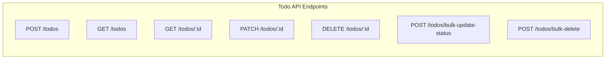

### 3.3 Endpoint Specifications

#### 3.3.1 Create Todo
```
POST /api/v1/todos
```

**Request Body**:
- `title` (required): string, max 100 chars
- `description` (optional): string, max 1000 chars
- `dueDate` (optional): string, YYYY-MM-DD format, cannot be past
- `priority` (optional): enum ["low", "medium", "high", "urgent"], defaults to "medium"

**Response** (201 Created):
- Complete todo object with generated `id`, `createdAt`, `modifiedAt`
- Status set to `initial`

**Errors**:
- 400: Validation error (field-specific)

---

#### 3.3.2 Get Todo by ID
```
GET /api/v1/todos/:id
```

**Path Parameters**:
- `id` (required): UUID

**Response** (200 OK):
- Complete todo object with calculated status

**Errors**:
- 404: Todo not found

---

#### 3.3.3 List and Filter Todos
```
GET /api/v1/todos
```

**Query Parameters** (all optional):
Filter format: `fieldname=comparator:value`

- `status=equals:initial|complete|due` or `status=notEquals:initial|complete|due`
- `priority=equals:low|medium|high|urgent` or `priority=notEquals:low|medium|high|urgent`
- `dueDate=before:YYYY-MM-DD` or `dueDate=after:YYYY-MM-DD` or `dueDate=notBefore:YYYY-MM-DD` or `dueDate=notAfter:YYYY-MM-DD`
- `title=contains:text` or `title=notContains:text` (case-insensitive)
- `description=contains:text` or `description=notContains:text` (case-insensitive)

**Filter Rules**:
- Only one filter per field is allowed
- Multiple different fields can be combined with AND logic
- Example: `?status=equals:initial&priority=notEquals:low&title=contains:meeting`

**Filter Logic**: AND combination of all provided filters

**Response** (200 OK):
- Array of todo objects with calculated status

**Errors**:
- 400: Invalid filter parameters (field-specific)

---

#### 3.3.4 Update Todo
```
PATCH /api/v1/todos/:id
```

**Path Parameters**:
- `id` (required): UUID

**Request Body** (all optional, partial update):
- `title`: string, max 100 chars
- `description`: string, max 1000 chars, or null to clear
- `dueDate`: string, YYYY-MM-DD, or null to clear, cannot be past
- `status`: enum ["initial", "complete"], cannot be "due"
- `priority`: enum ["low", "medium", "high", "urgent"]

**Response** (200 OK):
- Updated todo object with calculated status

**Errors**:
- 400: Validation error or invalid status transition
- 404: Todo not found

---

#### 3.3.5 Delete Todo
```
DELETE /api/v1/todos/:id
```

**Path Parameters**:
- `id` (required): UUID

**Response** (204 No Content):
- Empty body

**Errors**:
- 404: Todo not found

---

#### 3.3.6 Bulk Update Status
```
POST /api/v1/todos/bulk-update-status
```

**Request Body**:
- `ids` (required): array of UUIDs, max 100 items
- `status` (required): enum ["initial", "complete"]

**Response** (200 OK):
- Array of updated todo objects with calculated status

**Errors**:
- 400: Validation error, invalid transition, or exceeds max limit (atomic rollback)
- 404: Any todo not found (atomic rollback)

---

#### 3.3.7 Bulk Delete
```
POST /api/v1/todos/bulk-delete
```

**Request Body**:
- `ids` (required): array of UUIDs, max 100 items

**Response** (204 No Content):
- Empty body

**Errors**:
- 400: Exceeds max limit (atomic rollback)
- 404: Any todo not found (atomic rollback)

---

### 3.4 Response Formats

#### Success Response
```json
{
  "data": { /* todo object or array */ }
}
```

#### Error Response
```json
{
  "error": {
    "code": "VALIDATION_ERROR",
    "message": "Validation failed",
    "details": [
      {
        "field": "title",
        "message": "Title is required and must not exceed 100 characters"
      }
    ]
  }
}
```

### 3.5 Status Codes

| Code | Meaning | Usage |
|------|---------|-------|
| 200 | OK | Successful GET, PATCH, or bulk update |
| 201 | Created | Successful POST (create) |
| 204 | No Content | Successful DELETE |
| 400 | Bad Request | Validation error or business rule violation |
| 404 | Not Found | Todo not found |
| 409 | Conflict | Concurrent modification or file lock timeout |
| 500 | Internal Server Error | Unexpected server error |

---

## 4. Data Design

### 4.1 JSON File Storage Schema

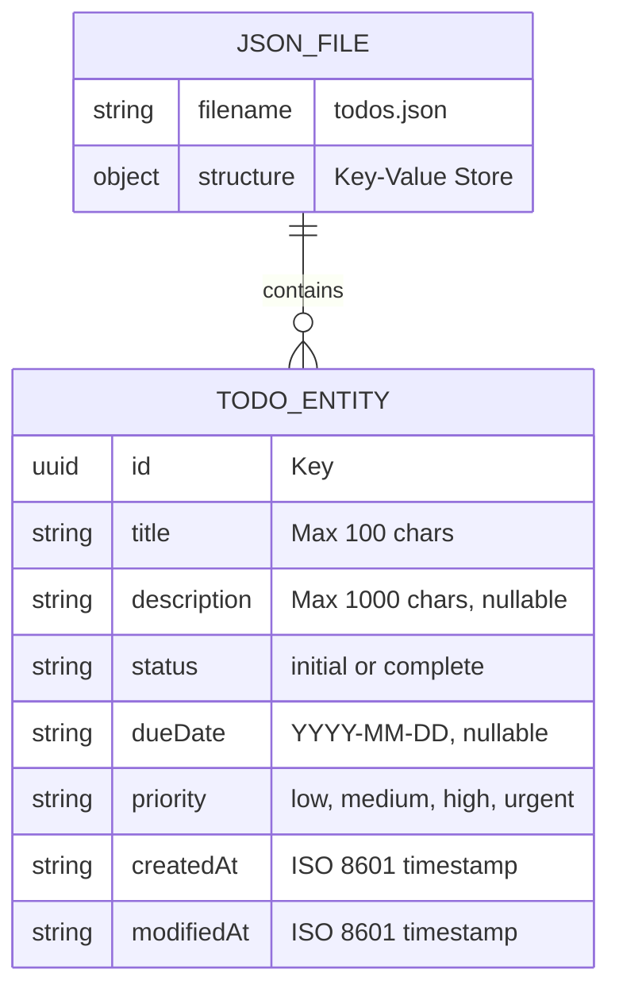

### 4.2 File Structure

**File Name**: `todos.json`

**Structure**: Key-Value Store
```json
{
  "uuid-1": {
    "id": "uuid-1",
    "title": "Example Todo",
    "description": "Description text",
    "status": "initial",
    "dueDate": "2025-12-31",
    "priority": "medium",
    "createdAt": "2025-11-10T10:00:00.000Z",
    "modifiedAt": "2025-11-10T10:00:00.000Z"
  },
  "uuid-2": { ... }
}
```

### 4.3 Storage Specifications

| Aspect | Specification |
|--------|--------------|
| **File Format** | JSON (UTF-8 encoded) |
| **Structure** | Single-level object with UUID keys |
| **Key** | UUID v4 string |
| **Value** | Todo entity object |
| **File Location** | Configurable (default: `./data/todos.json`) |
| **File Size** | Expected < 1MB for typical usage (< 10,000 todos) |
| **Encoding** | UTF-8 |
| **Pretty Print** | Configurable (recommended: disabled for production) |

### 4.4 Data Validation

**Field Constraints** (enforced at application layer):
- `id`: Must be valid UUID v4
- `title`: Required, 1-100 characters, non-whitespace
- `description`: Optional, max 1000 characters or null
- `status`: Must be "initial" or "complete"
- `dueDate`: Optional, YYYY-MM-DD format or null
- `priority`: Must be "low", "medium", "high", or "urgent"
- `createdAt`: ISO 8601 timestamp with millisecond precision
- `modifiedAt`: ISO 8601 timestamp with millisecond precision

### 4.5 File Operations

**Atomic Updates**:
1. Read entire file into memory
2. Parse JSON
3. Apply modifications
4. Validate changes
5. Write to temporary file
6. Atomic rename/replace original file

**Concurrency Control**:
- File-level locking during read-modify-write operations
- Lock timeout: 5 seconds
- Retry mechanism for lock conflicts

---

## 5. Business Logic

### 5.1 Status Calculation Algorithm

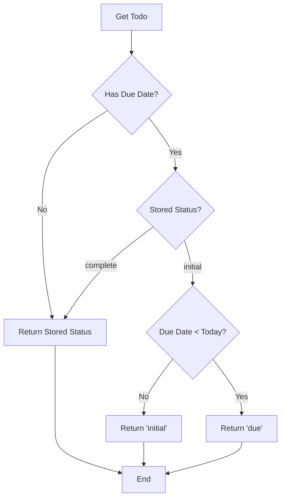

**Pseudocode**:
```
function calculateStatus(todo, currentDate):
    if todo.status == 'complete':
        return 'complete'
    
    if todo.dueDate == null:
        return todo.status  // 'initial'
    
    if currentDate > todo.dueDate and todo.status == 'initial':
        return 'due'
    
    return todo.status  // 'initial'
```

### 5.2 Status Transition Validation

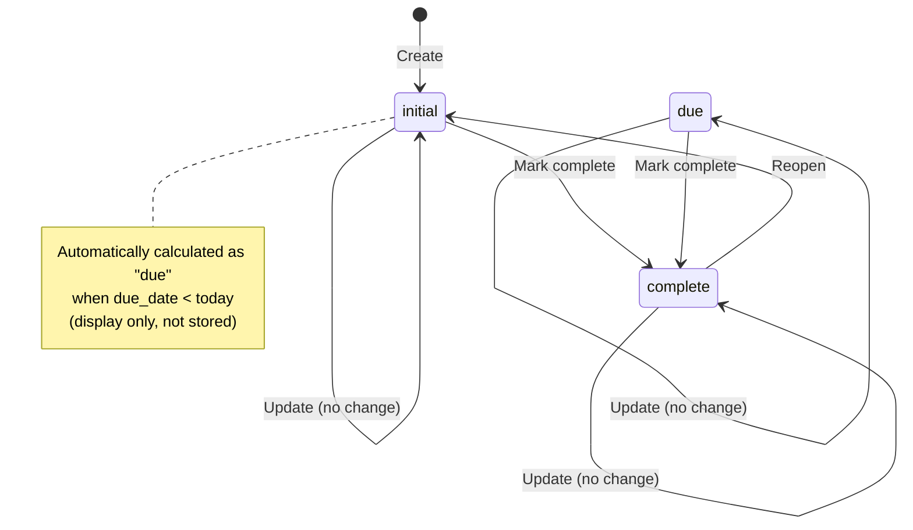

**Validation Rules**:
1. Can transition from `initial` to `complete`
2. Can transition from `complete` to `initial`
3. Can transition from calculated `due` to `complete`
4. **Cannot** transition from calculated `due` to `initial` if due date is in past
5. User can never manually set status to `due`

### 5.3 Filtering Logic

**Implementation**:
- All filters use AND logic (intersection of results)
- Status filters operate on calculated status, not stored status
- String filters (contains/notContains) are case-insensitive
- Date filters use standard date comparison
- Empty filter list returns all todos

### 5.4 Bulk Operations

**Transaction Flow**:
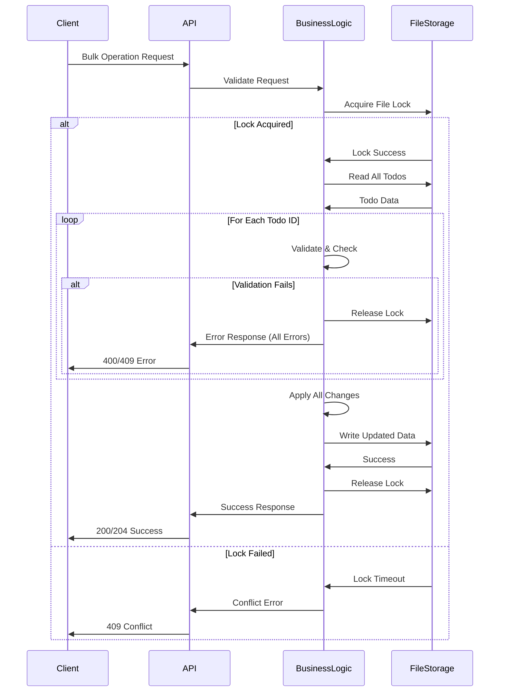

**Validation-First Approach**:
1. Acquire exclusive file lock
2. Read entire file
3. Validate ALL items before making any changes
4. If any validation fails, release lock and return all errors
5. If all validations pass, apply changes in memory
6. Write updated data atomically
7. Release lock

---

## 6. Data Flow

### 6.1 Create Todo Flow

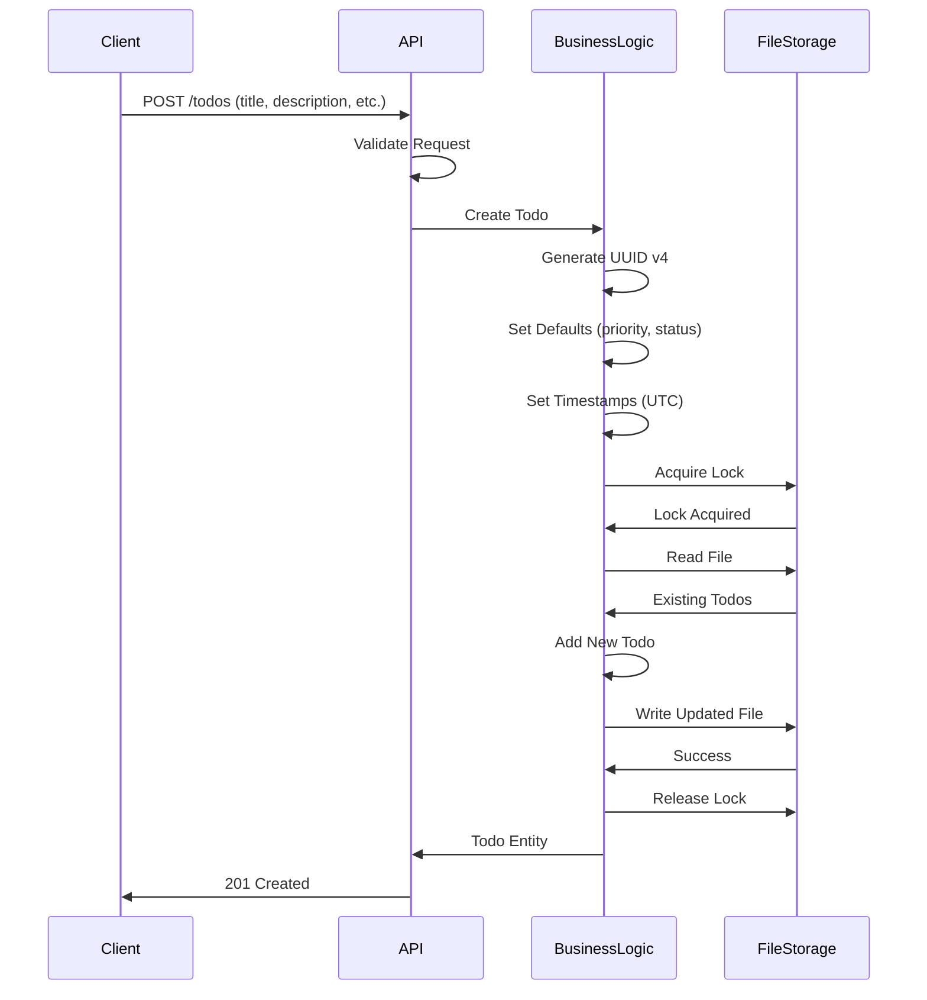

### 6.2 List with Filtering Flow

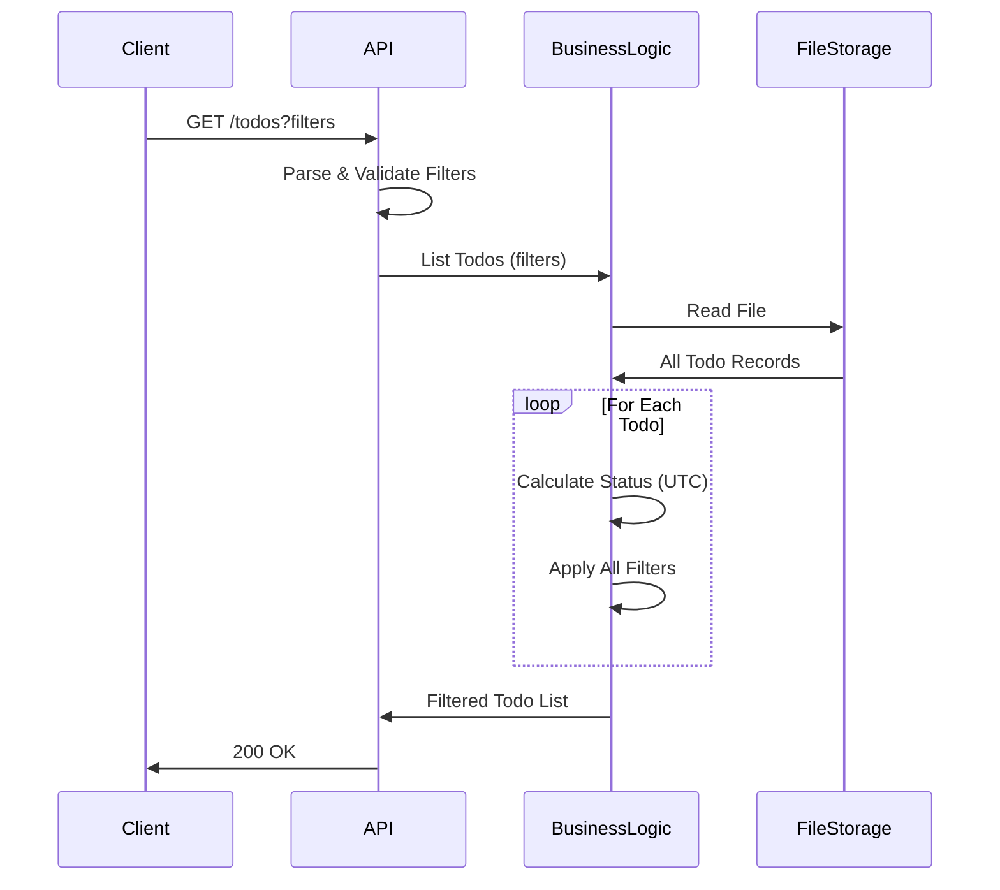

---

## 7. Non-Functional Requirements

### 7.1 Performance Targets

| Operation | Target Response Time |
|-----------|---------------------|
| Create Todo | < 100ms |
| Get Todo by ID | < 50ms |
| List/Filter Todos | < 200ms |
| Update Todo | < 100ms |
| Delete Todo | < 50ms |
| Bulk Operations | < 500ms (for 100 items) |

### 7.2 Scalability

- **Current**: Single-user system, optimized for < 10,000 todos
- **Database**: Standard relational database with indexed queries
- **Concurrency**: Last-write-wins, no locking overhead

### 7.3 Reliability

- **Atomicity**: Bulk operations use database transactions
- **Data Integrity**: Database constraints enforce valid states
- **Error Handling**: Graceful degradation with detailed error messages

### 7.4 Security Considerations

- **Current Scope**: No authentication/authorization (single-user)
- **Future**: Add authentication layer before API endpoints
- **Data Validation**: Strict input validation on all endpoints
- **Error Messages**: Field-specific errors (acceptable for single-user)

---

## 8. Technology Considerations

### 8.1 Recommended Stack

| Component | Recommendation |
|-----------|---------------|
| **Storage** | JSON File (single-user optimized) |
| **File Locking** | `proper-lockfile` (Node.js), `filelock` (Python), `java.nio.file.FileLock` (Java) |
| **API Framework** | Express.js (Node.js), FastAPI (Python), Spring Boot (Java) |
| **Validation** | Zod (TypeScript), Joi (JavaScript), Pydantic (Python) |
| **UUID Generation** | `uuid` library (Node.js/Python), `java.util.UUID` (Java) |
| **File I/O** | `fs.promises` (Node.js), `pathlib` (Python), `java.nio.file` (Java) |

### 8.2 JSON File Storage Considerations

| Aspect | Consideration | Mitigation |
|--------|--------------|------------|
| **Performance** | Full file read/write on every operation | Acceptable for < 10K todos; future: in-memory cache |
| **Concurrency** | File locking can be bottleneck | Lock timeout with retry; future: database migration |
| **Data Corruption** | Power loss during write | Atomic write via temp file + rename |
| **Backup** | Manual file copy | Simple file-based backup strategy |
| **Scalability** | Limited to single process | Sufficient for single-user; future: database for multi-user |
| **Filtering** | In-memory filtering (no indexing) | Fast enough for small datasets |

---

## 9. Deployment Architecture

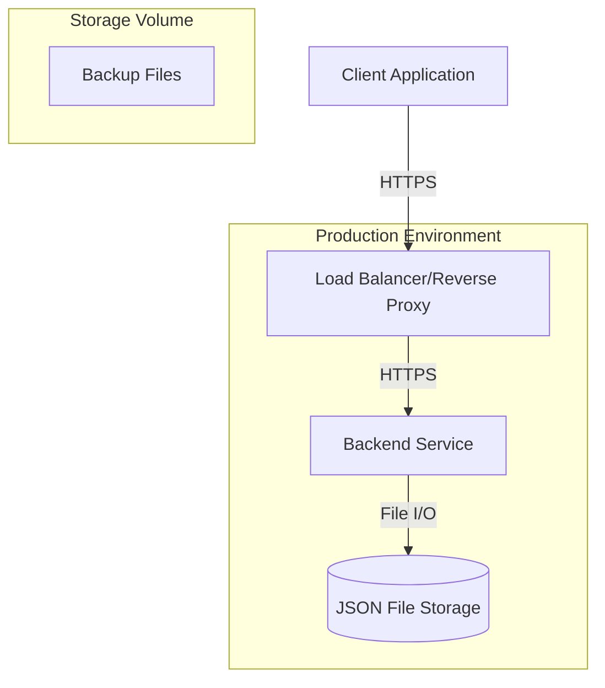

### 9.1 Deployment Components

| Component | Purpose | Scaling |
|-----------|---------|---------|
| **Load Balancer** | SSL termination, request routing | N/A (single user) |
| **Backend Service** | API processing | Single instance (file-locked) |
| **JSON File Storage** | Persistent storage | Persistent volume mount |
| **Storage Volume** | Data persistence | Backed up regularly |

### 9.2 Deployment Considerations

- **Single Instance**: Only one backend instance due to file locking
- **Persistent Volume**: JSON file must be on persistent storage
- **Backup Strategy**: Regular file snapshots/copies
- **Recovery**: Restore from backup file
- **Zero-Downtime**: Not possible with file locking (brief downtime acceptable for single-user)

---

## 10. Future Architecture Evolution

### 10.1 Multi-User Support

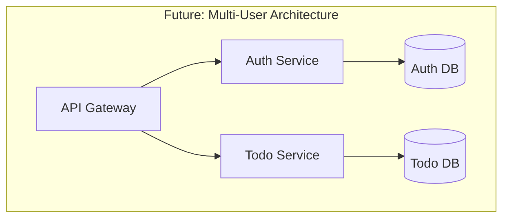

**Changes Required**:
- Add `user_id` column to `todos` table
- Implement authentication/authorization layer
- Add user management service
- Implement tenant isolation in queries

### 10.2 Pagination & Advanced Features

**Schema Changes**:
- Add soft delete: `deleted_at` column
- Add search optimization: Full-text search indexes
- Add audit trail: `todos_history` table

---

## 11. Open Design Questions

See `hld.clarification.md` for specific questions requiring product decisions.

---

## 12. Design Alternatives & Suggestions

See `hld.suggestions.md` for alternative approaches and optimization suggestions.

---

## Appendix A: Model References

- **API Models**: See `api-model.ts` for Zod validation schemas
- **Database Models**: See `db-model.ts` for TypeScript entity types

---

## Appendix B: Glossary

| Term | Definition |
|------|------------|
| **UUID** | Universally Unique Identifier (RFC 4122) |
| **ACID** | Atomicity, Consistency, Isolation, Durability |
| **REST** | Representational State Transfer |
| **ORM** | Object-Relational Mapping |
| **Last-Write-Wins** | Concurrency model where most recent write takes precedence |
| **Calculated Status** | Status computed on-demand, not stored in database |
| **Atomic Operation** | All-or-nothing operation (all succeed or all fail) |

---

**Document Status**: Ready for Review  
**Next Steps**: API implementation, database setup, integration testing

