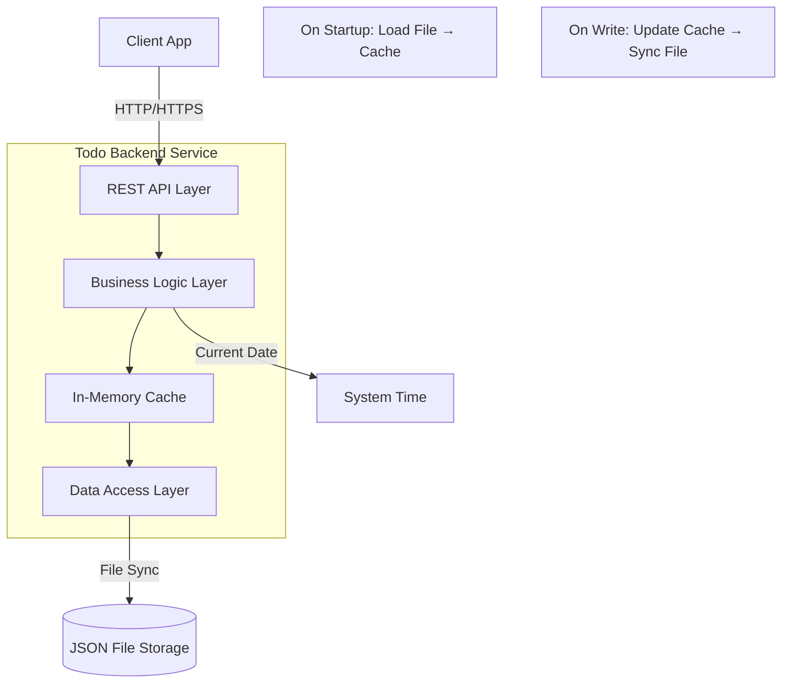
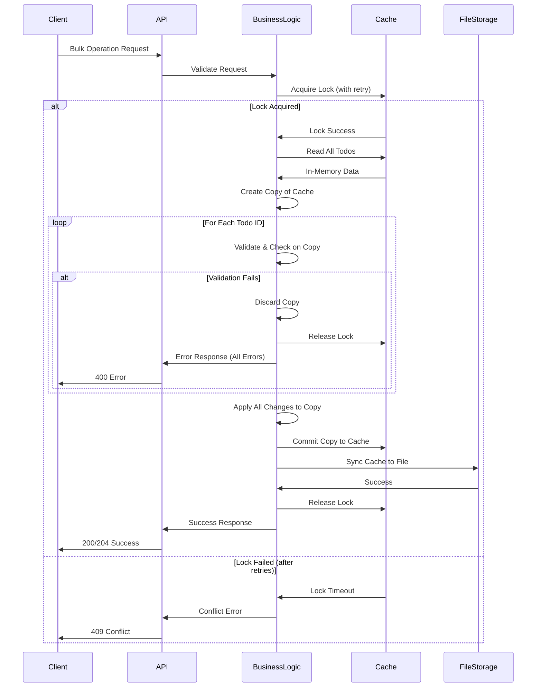
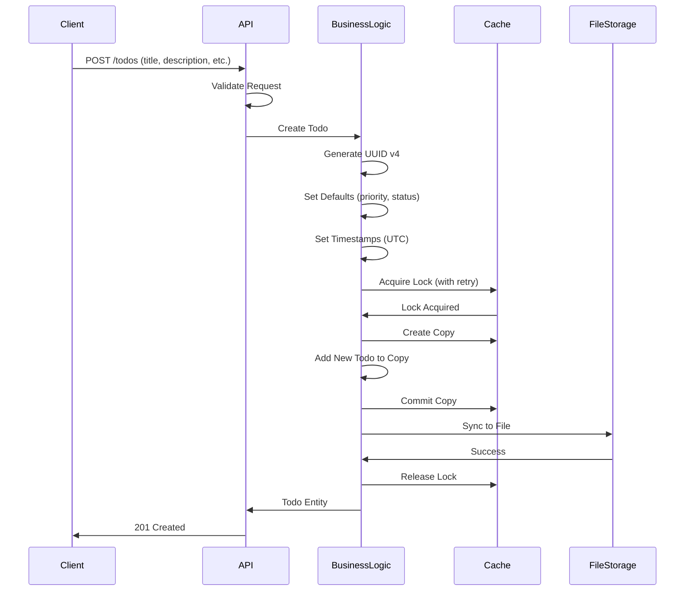
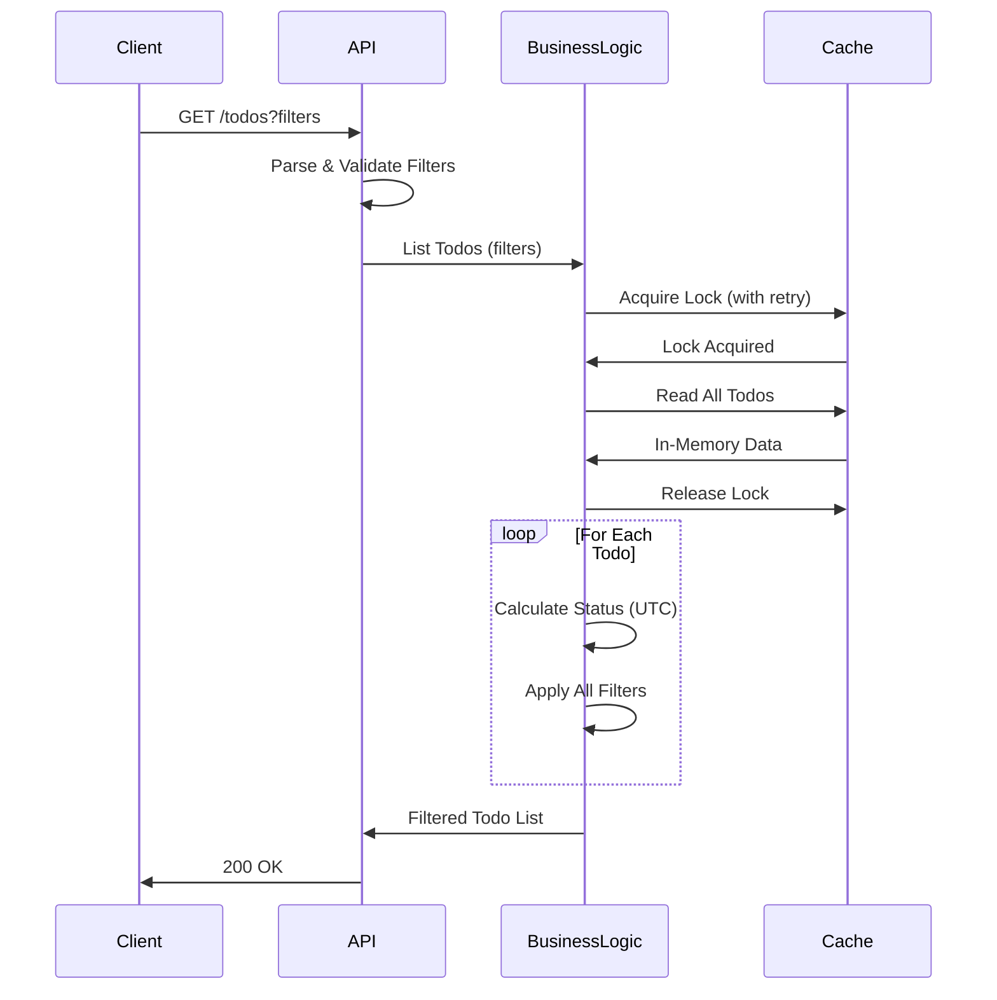

# High-Level Design (HLD) - Todo Management Application

**Version:** 1.0  
**Date:** November 10, 2025  
**Status:** Draft

---

## 1. Overview

This document describes the high-level architecture, API design, and database schema for the Todo Management Application - a backend-focused, single-user task management system with automatic overdue tracking and comprehensive filtering capabilities.

---

## 2. Architecture

### 2.1 System Context


### 2.2 Component Architecture



### 2.3 Component Responsibilities

| Component | Responsibility |
|-----------|---------------|
| **REST API Layer** | Request validation, routing, response formatting, error handling |
| **Business Logic Layer** | Business rules, status calculation, filtering logic, bulk operations coordination, conflict detection |
| **In-Memory Cache** | Primary data store, loaded at startup, all reads/writes go through cache |
| **Data Access Layer** | File synchronization, atomic file updates, simple global lock flag |
| **JSON File Storage** | Persistent backup of in-memory cache (UUID → Todo key-value pairs) |
| **System Time** | Provides current date (UTC) for overdue calculation |

### 2.4 Key Design Decisions

1. **In-Memory Cache**: Primary data store loaded at startup from JSON file; all operations use cache
2. **File Synchronization**: Cache changes synced to file after each write operation
3. **Calculated Status**: Status "due" is computed on-read, never stored
4. **Simple Locking**: Global boolean flag for operation serialization (MVP simplicity)
5. **Atomic Operations**: Mutate on copy of cache, commit both cache and file atomically
6. **Validation-First**: Validate all bulk operation items before applying any changes
7. **Retry with Backoff**: Auto-retry on lock conflicts with exponential backoff
8. **Single Tenant**: No user context; all todos belong to implicit single user
9. **UTC Timezone**: All date calculations use UTC for consistency
10. **MVP Focus**: Minimal file handling, manual initialization, system default permissions

---

## 3. API Design

### 3.1 API Overview

**Protocol**: REST over HTTP/HTTPS  
**Data Format**: JSON  
**Base Path**: `/api/v1`

### 3.2 API Endpoints


### 3.3 Endpoint Specifications

#### 3.3.1 Create Todo
```
POST /api/v1/todos
```

**Request Body**:
- `title` (required): string, max 100 chars
- `description` (optional): string, max 1000 chars
- `dueDate` (optional): string, YYYY-MM-DD format, cannot be past
- `priority` (optional): enum ["low", "medium", "high", "urgent"], defaults to "medium"

**Response** (201 Created):
- Complete todo object with generated `id`, `createdAt`, `modifiedAt`
- Status set to `initial`

**Errors**:
- 400: Validation error (field-specific)

---

#### 3.3.2 Get Todo by ID
```
GET /api/v1/todos/:id
```

**Path Parameters**:
- `id` (required): UUID

**Response** (200 OK):
- Complete todo object with calculated status

**Errors**:
- 404: Todo not found

---

#### 3.3.3 List and Filter Todos
```
GET /api/v1/todos
```

**Query Parameters** (all optional):
Filter format: `fieldname=comparator:value`

- `status=equals:initial|complete|due` or `status=notEquals:initial|complete|due`
- `priority=equals:low|medium|high|urgent` or `priority=notEquals:low|medium|high|urgent`
- `dueDate=before:YYYY-MM-DD` or `dueDate=after:YYYY-MM-DD` or `dueDate=notBefore:YYYY-MM-DD` or `dueDate=notAfter:YYYY-MM-DD`
- `title=contains:text` or `title=notContains:text` (case-insensitive)
- `description=contains:text` or `description=notContains:text` (case-insensitive)

**Filter Rules**:
- Only one filter per field is allowed
- Multiple different fields can be combined with AND logic
- Example: `?status=equals:initial&priority=notEquals:low&title=contains:meeting`

**Filter Logic**: AND combination of all provided filters

**Response** (200 OK):
- Array of todo objects with calculated status

**Errors**:
- 400: Invalid filter parameters (field-specific)

---

#### 3.3.4 Update Todo
```
PATCH /api/v1/todos/:id
```

**Path Parameters**:
- `id` (required): UUID

**Request Body** (all optional, partial update):
- `title`: string, max 100 chars
- `description`: string, max 1000 chars, or null to clear
- `dueDate`: string, YYYY-MM-DD, or null to clear, cannot be past
- `status`: enum ["initial", "complete"], cannot be "due"
- `priority`: enum ["low", "medium", "high", "urgent"]

**Response** (200 OK):
- Updated todo object with calculated status

**Errors**:
- 400: Validation error or invalid status transition
- 404: Todo not found

---

#### 3.3.5 Delete Todo
```
DELETE /api/v1/todos/:id
```

**Path Parameters**:
- `id` (required): UUID

**Response** (204 No Content):
- Empty body

**Errors**:
- 404: Todo not found

---

#### 3.3.6 Bulk Update Status
```
POST /api/v1/todos/bulk-update-status
```

**Request Body**:
- `ids` (required): array of UUIDs, max 100 items
- `status` (required): enum ["initial", "complete"]

**Response** (200 OK):
- Array of updated todo objects with calculated status

**Errors**:
- 400: Validation error, invalid transition, or exceeds max limit (atomic rollback)
- 404: Any todo not found (atomic rollback)

---

#### 3.3.7 Bulk Delete
```
POST /api/v1/todos/bulk-delete
```

**Request Body**:
- `ids` (required): array of UUIDs, max 100 items

**Response** (204 No Content):
- Empty body

**Errors**:
- 400: Exceeds max limit (atomic rollback)
- 404: Any todo not found (atomic rollback)

---

### 3.4 Response Formats

#### Success Response
```json
{
  "data": { /* todo object or array */ }
}
```

#### Error Response
```json
{
  "error": {
    "code": "VALIDATION_ERROR",
    "message": "Validation failed",
    "details": [
      {
        "field": "title",
        "message": "Title is required and must not exceed 100 characters"
      }
    ]
  }
}
```

### 3.5 Status Codes

| Code | Meaning | Usage |
|------|---------|-------|
| 200 | OK | Successful GET, PATCH, or bulk update |
| 201 | Created | Successful POST (create) |
| 204 | No Content | Successful DELETE |
| 400 | Bad Request | Validation error or business rule violation |
| 404 | Not Found | Todo not found |
| 409 | Conflict | Concurrent modification or file lock timeout |
| 500 | Internal Server Error | Unexpected server error |

---

## 4. Data Design

### 4.1 JSON File Storage Schema


### 4.2 File Structure

**File Name**: `todos.json`

**Structure**: Key-Value Store
```json
{
  "uuid-1": {
    "id": "uuid-1",
    "title": "Example Todo",
    "description": "Description text",
    "status": "initial",
    "dueDate": "2025-12-31",
    "priority": "medium",
    "createdAt": "2025-11-10T10:00:00.000Z",
    "modifiedAt": "2025-11-10T10:00:00.000Z"
  },
  "uuid-2": { ... }
}
```

### 4.3 Storage Specifications

| Aspect | Specification |
|--------|--------------|
| **File Format** | JSON (UTF-8 encoded) |
| **Structure** | Single-level object with UUID keys |
| **Key** | UUID v4 string |
| **Value** | Todo entity object |
| **File Location** | Configurable (default: `./data/todos.json`) |
| **File Size** | Expected < 1MB for typical usage (< 10,000 todos) |
| **Encoding** | UTF-8 |
| **Pretty Print** | Configurable (recommended: disabled for production) |

### 4.4 Data Validation

**Field Constraints** (enforced at application layer):
- `id`: Must be valid UUID v4
- `title`: Required, 1-100 characters, non-whitespace
- `description`: Optional, max 1000 characters or null
- `status`: Must be "initial" or "complete"
- `dueDate`: Optional, YYYY-MM-DD format or null
- `priority`: Must be "low", "medium", "high", or "urgent"
- `createdAt`: ISO 8601 timestamp with millisecond precision
- `modifiedAt`: ISO 8601 timestamp with millisecond precision

### 4.5 Cache and File Operations

**Startup Sequence**:
1. Check if JSON file exists (fail if missing - manual initialization required)
2. Read and parse JSON file
3. Validate file structure and data integrity
4. Load into in-memory cache (Record<UUID, TodoEntity>)
5. Application ready to serve requests

**Read Operations**:
1. All reads served directly from in-memory cache
2. No file I/O on reads
3. Status calculated on-demand from cache data

**Write Operations** (Copy-on-Write Pattern):
1. Acquire global lock (simple boolean flag)
2. Create copy of in-memory cache
3. Apply modifications to copy
4. Validate all changes
5. If valid: commit copy to cache, sync to file
6. If invalid: discard copy, release lock, return error
7. Release global lock

**File Synchronization**:
- Write entire cache to file after each mutation
- In-memory write (no temp file)
- File permissions: system defaults
- Encoding: UTF-8
- Format: ISO 8601 timestamps with millisecond precision
- Null fields: stored as explicit `null`

**Concurrency Control**:
- Simple global boolean lock flag (not file-system level)
- Lock on all operations (read and write)
- Retry with exponential backoff on lock conflicts
- Backoff: 50ms, 100ms, 200ms, 400ms, 800ms
- Max retries: 5

---

## 5. Business Logic

### 5.1 Status Calculation Algorithm


**Pseudocode**:
```
function calculateStatus(todo, currentDate):
    if todo.status == 'complete':
        return 'complete'
    
    if todo.dueDate == null:
        return todo.status  // 'initial'
    
    if currentDate > todo.dueDate and todo.status == 'initial':
        return 'due'
    
    return todo.status  // 'initial'
```

### 5.2 Status Transition Validation


**Validation Rules**:
1. Can transition from `initial` to `complete`
2. Can transition from `complete` to `initial`
3. Can transition from calculated `due` to `complete`
4. **Cannot** transition from calculated `due` to `initial` if due date is in past
5. User can never manually set status to `due`

### 5.3 Filtering Logic

**Implementation**:
- All filters use AND logic (intersection of results)
- Status filters operate on calculated status, not stored status
- String filters (contains/notContains) are case-insensitive
- Date filters use standard date comparison
- Empty filter list returns all todos

### 5.4 Bulk Operations

**Transaction Flow**:


**Validation-First Approach**:
1. Acquire global lock (with exponential backoff retry)
2. Create copy of in-memory cache
3. Validate ALL items on the copy before making any changes
4. If any validation fails, discard copy, release lock, return all errors
5. If all validations pass, apply changes to copy
6. Commit copy to main cache
7. Sync cache to file
8. Release lock

---

## 6. Data Flow

### 6.1 Create Todo Flow



### 6.2 List with Filtering Flow



---

## 7. Non-Functional Requirements

### 7.1 Performance Targets

| Operation | Target Response Time | Notes |
|-----------|---------------------|-------|
| Create Todo | < 100ms | Includes file sync |
| Get Todo by ID | < 10ms | Memory-only (no I/O) |
| List/Filter Todos | < 50ms | Memory-only (no I/O) |
| Update Todo | < 100ms | Includes file sync |
| Delete Todo | < 100ms | Includes file sync |
| Bulk Operations | < 500ms (for 100 items) | Includes file sync |
| Startup | < 2s | File load and validation |

### 7.2 Scalability

- **Current**: Single-user system, in-memory optimized, unlimited todos (memory-constrained)
- **Memory**: ~1KB per todo (estimate: 10,000 todos = ~10MB memory)
- **Storage**: In-memory cache, no indexing needed
- **Concurrency**: Simple global lock with retry, minimal overhead
- **File I/O**: Only on write operations (not reads)

### 7.3 Reliability

- **Atomicity**: Copy-on-write pattern ensures all-or-nothing updates
- **Data Integrity**: Application-layer validation before committing to cache
- **Error Handling**: Validation-first with detailed error messages
- **Crash Recovery**: File persisted after each write; load on restart
- **Data Loss Risk**: Uncommitted in-memory changes lost on crash (minimal window)

### 7.4 Security Considerations

- **Current Scope**: No authentication/authorization (single-user MVP)
- **Future**: Add authentication layer before API endpoints
- **Data Validation**: Strict input validation on all endpoints
- **Error Messages**: Field-specific errors (acceptable for single-user MVP)
- **File Access**: System default permissions (MVP simplicity)

---

## 8. Technology Considerations

### 8.1 Recommended Stack (MVP)

| Component | Recommendation |
|-----------|---------------|
| **Storage** | In-memory cache + JSON file persistence |
| **Locking** | Simple global boolean flag (no external library) |
| **API Framework** | Express.js (Node.js), FastAPI (Python), Spring Boot (Java) |
| **Validation** | Zod (TypeScript), Joi (JavaScript), Pydantic (Python) |
| **UUID Generation** | `uuid` library (Node.js/Python), `java.util.UUID` (Java) |
| **File I/O** | `fs.promises` (Node.js), `pathlib` (Python), `java.nio.file` (Java) |

### 8.2 In-Memory Cache with File Persistence

| Aspect | Approach | Notes |
|--------|----------|-------|
| **Primary Storage** | In-memory cache (Record/Map/Dictionary) | All operations use cache |
| **Persistence** | JSON file sync after writes | File acts as backup |
| **Performance** | O(1) lookups, O(n) filtering | Very fast for typical workloads |
| **Concurrency** | Simple global lock flag | MVP simplicity over sophistication |
| **Startup** | Load file into memory | Fail if file missing or corrupted |
| **Memory Usage** | ~1KB per todo | 10K todos = ~10MB (acceptable) |
| **Data Loss Risk** | Only uncommitted in-memory changes | Minimal window (writes sync immediately) |
| **Scalability** | Memory-constrained | Suitable for MVP, not production scale |

---

## 9. Deployment Architecture


### 9.1 Deployment Components

| Component | Purpose | Scaling |
|-----------|---------|---------|
| **Load Balancer** | SSL termination, request routing | N/A (single user) |
| **Backend Service** | API processing | Single instance (file-locked) |
| **JSON File Storage** | Persistent storage | Persistent volume mount |
| **Storage Volume** | Data persistence | Backed up regularly |

### 9.2 Deployment Considerations (MVP)

- **Single Instance**: Only one backend instance (in-memory cache constraint)
- **Persistent Volume**: JSON file must be on persistent storage
- **Initialization**: JSON file must exist before startup (manual creation required)
- **Backup Strategy**: External file copy/snapshot (not in application)
- **Recovery**: Restore file and restart application
- **Zero-Downtime**: Not applicable for MVP
- **Memory Requirements**: Allocate sufficient RAM for cache (10MB per 10K todos)
- **Crash Recovery**: Load file on startup; uncommitted changes lost

---

## 10. Future Architecture Evolution

### 10.1 Multi-User Support


**Changes Required**:
- Add `user_id` column to `todos` table
- Implement authentication/authorization layer
- Add user management service
- Implement tenant isolation in queries

### 10.2 Pagination & Advanced Features

**Schema Changes**:
- Add soft delete: `deleted_at` column
- Add search optimization: Full-text search indexes
- Add audit trail: `todos_history` table

---

## 11. MVP Simplifications

This design prioritizes MVP simplicity over production robustness. Key simplifications:

### Accepted Trade-offs:
1. **Simple Locking**: Global boolean flag instead of file-system locks or sophisticated locking library
2. **Manual Initialization**: File must be created manually before first run (no auto-creation)
3. **System Permissions**: Use OS defaults instead of explicit 600 permissions
4. **No Size Limits**: Unlimited todos (constrained only by memory)
5. **No Validation on Startup**: File loaded without integrity checks
6. **No Backups**: External backup responsibility (not in application)
7. **No File Versioning**: No history or rollback capability
8. **No Repair Tools**: Manual recovery required for corruption
9. **No Metrics**: No performance monitoring or statistics
10. **In-Memory Write**: File written directly from memory (no temp file)

### MVP Risks:
- **Data Loss**: Crash during write loses uncommitted changes
- **No Corruption Detection**: Invalid JSON causes startup failure
- **Memory Constraints**: Large datasets may exhaust memory
- **Concurrency**: Simple lock may be insufficient under load
- **No Audit Trail**: No logging of file operations

### Production Migration Path:
When moving beyond MVP, consider:
1. Add file integrity checks and validation
2. Implement proper file locking library
3. Add comprehensive error handling and recovery
4. Implement backup and versioning
5. Migrate to database for scalability
6. Add monitoring and metrics
7. Implement proper security (file permissions, encryption)

---

## 12. Open Design Questions

All clarifications answered. See `hld.clarification.md` and `hld.clarification.new.md` for details.

---

## 13. Design Alternatives & Suggestions

See `hld.suggestions.md` and `hld.suggestions.new.md` for alternative approaches (mostly rejected for MVP).

---

## Appendix A: Model References

- **API Models**: See `api-model.ts` for Zod validation schemas
- **Database Models**: See `db-model.ts` for TypeScript entity types

---

## Appendix B: Glossary

| Term | Definition |
|------|------------|
| **UUID** | Universally Unique Identifier (RFC 4122) |
| **ACID** | Atomicity, Consistency, Isolation, Durability |
| **REST** | Representational State Transfer |
| **ORM** | Object-Relational Mapping |
| **Last-Write-Wins** | Concurrency model where most recent write takes precedence |
| **Calculated Status** | Status computed on-demand, not stored in database |
| **Atomic Operation** | All-or-nothing operation (all succeed or all fail) |

---

**Document Status**: Ready for Review  
**Next Steps**: API implementation, database setup, integration testing

