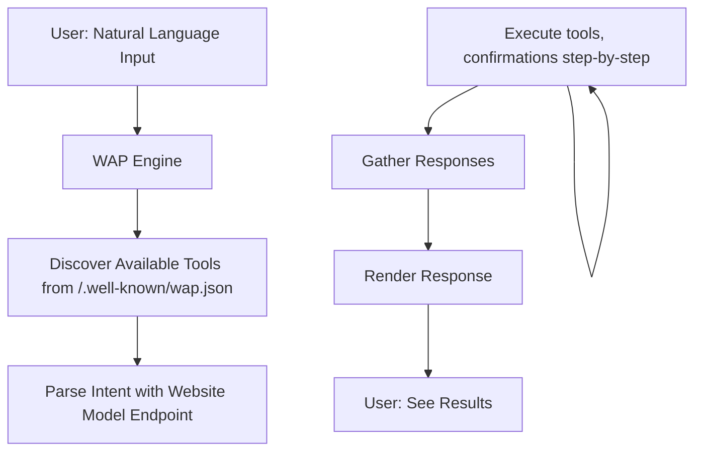
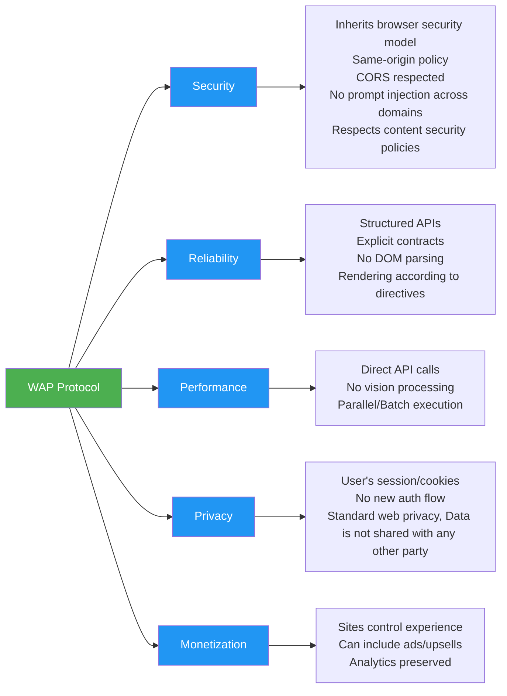

# WAP: A Safe, Cooperative Path to Agentic Browsing

*A new approach to Agentic Browsing that enables website owners and users both win when AI agents respect the web's paradigm and security model*

---

The race for agentic browsers is heating up. OpenAI launched [ChatGPT Atlas](https://openai.com/index/introducing-chatgpt-atlas/), Perplexity shipped [Comet](https://www.perplexity.ai/comet), and Amazon is [fighting back](https://www.aboutamazon.com/news/company-news/amazon-perplexity-comet-statement) against what they see as deception/degraded customer experiences. There's a fundamental problem with the current approaches: these solutions are **adversarial to website owners** and create **serious security vulnerabilities, and privacy concerns** for users.

What if there was a better way? One that respects website owners, protects users, and actually works reliably?

Enter **WAP (Web Agent Protocol)** - a draft specification that enables safe, secure, privacy-enabled agentic browsing by having websites expose their functionality as discoverable, invokable tools for the WAP AI agent.

## The Problem With Current Agentic Browsers

Current agentic browsers like Comet and Atlas use **DOM manipulation and accessibility tree parsing** to automate web interactions. They build models from the Document Object Model and perform actions by simulating clicks, form fills, and navigation - essentially treating every website as an uncooperative partner to be automated around. They also attempt to perform complex multi-site operations which then introduce a lot of security and privacy challenges.  

The current approach creates three critical problems:

### 1. Security

Atlas's "agent mode" allows ChatGPT to operate browsers semi-autonomously with access to browsing context, seeing every open tab, interacting with forms, clicking buttons, taking screenshots, and navigating between pages. Combined with "browser memories" that log websites and activities, the AI builds detailed understanding of users' digital lives.

[Brave Security's research](https://brave.com/blog/comet-prompt-injection/) revealed that Comet is vulnerable to **prompt injection attacks across domains**:

> "When an AI assistant follows malicious instructions from untrusted webpage content, traditional protections such as same-origin policy (SOP) or cross-origin resource sharing (CORS) are all effectively useless. The AI operates with the user's full privileges across authenticated sessions, providing potential access to banking accounts, corporate systems, private emails, cloud storage, and other services."

Imagine visiting a seemingly innocent shopping site that contains invisible instructions directing the AI agent to scrape personal data from all your open tabs - your medical portal, draft emails, banking information. The AI can't distinguish between legitimate instructions from the user and malicious instructions embedded in web content.

### 2. Unreliability

Comet relies on DOM and accessibility trees, which means it cannot interact with images, icons, or SVG elements that lack proper labels or ARIA attributes. It also cannot access cross-origin iframes.

The web is messy. Many sites don't follow accessibility best practices. Complex SPAs use custom components that don't map cleanly to semantic HTML. The result? Automation that works beautifully on well-structured sites but fails unpredictably on the real web.

[A technical analysis of Comet](https://www.harness.io/blog/reverse-engineering-comet) demonstrated this limitation - it failed to click on unlabeled cart icons and struggled with elements that weren't properly marked up in the accessibility tree.

### 3. Adversarial to Website Owners

Amazon's recent statement about Perplexity's Comet highlights a crucial concern:

> "We prioritize making browsing easy for customers and our [customer-obsessed innovation] is what has led to transformational products over the last three decades..."

Website owners invest millions in building curated experiences, conversion funnels, upselling strategies, and monetization. DOM-scraping agents bypass all of this, potentially:
- Eliminating ad revenue
- Breaking analytics and A/B testing
- Bypassing rate limiting and abuse protection
- Degrading carefully designed user experiences
- Removing sponsored content and recommendations

**This is why adoption will be slow.** Major platforms like Amazon, Netflix, and banking institutions will actively resist these approaches through technical countermeasures.
### 4. Privacy: Your Data Leaves the Browser

When you use Comet or Atlas in agent mode, **your requests and supporting context are sent to third-party servers** - Perplexity's and OpenAI's infrastructure respectively.

Consider this natural language request:
> "Search for romantic hotels in Napa Valley for December 14-16, 2025. Our budget is around $500/night. Also, my partner loves wine tasting - can you find wineries that offer private tours?"

**What you intended:** Share travel preferences with hotel booking sites to get personalized results.

**What actually happens:** This personal information - your travel dates, budget, partner's preferences, romantic occasion details - is transmitted to Perplexity's or OpenAI's servers for processing before ever reaching the hotel site.

According to [Perplexity's privacy FAQ](https://www.perplexity.ai/comet/resources/articles/comet-data-privacy-security-faq-s) and [OpenAI's Atlas data controls](https://help.openai.com/en/articles/12574142-chatgpt-atlas-data-controls-and-privacy), this data could be used for:
- Model inference and improvement
- Training future models (unless explicitly opted out)
- And kept for 30-day retention periods

**The prompt injection risk multiplies:** Not only can malicious websites manipulate the AI's behavior, but with the right techniques, attackers can potentially trick the agent into revealing sensitive information from your browsing context that was meant for completely different sites.

## WAP: The Cooperative Alternative

WAP takes a fundamentally different approach: **websites voluntarily expose their functionality as tools that AI agents can call.** This will help deliver a more simple, reliable and secure experience.



*Figure 1: WAP Architecture - [Technical Details](./technical-design.md)*

### No New Software Required

Here's a critical difference: **you don't need to download yet another browser or software** to get natural language and agentic features.

WAP meets users where they already are:
- **Your current browser** - Chrome, Safari, Firefox, Edge, whatever you use today
- **Your current device** - Desktop, mobile, tablet, even smart TVs
- **Your current platform** - Mac, Windows, Linux, iOS, Android

Just like a chatbot widget doesn't replace your website or redirect you elsewhere, WAP doesn't either. It's an **enhanced experience layer** that activates when you want it.

**For users:** Visit `https://amazon.ca?agentmode=1` and your familiar Amazon experience gains natural language superpowers. All your cookies, history, saved preferences, and logged-in session remain intact.

**For enterprises:** Adopt incrementally and on your terms. Start with one feature, expand at your pace. Your customers use your site exactly how they always have - with an optional natural language interface available when they want it.

Atlas and Comet ask users to abandon their existing browser and adopt new software. WAP asks nothing of users and gives enterprises full control of the rollout.

### How It Works

**Step 1: Discovery**

Websites publish a manifest at `/.well-known/wap.json` that declares their capabilities:

```json
{
  "name": "TodoApp",
  "version": "1.0",
  "tools": [
    {
      "name": "listTodos",
      "type": "server",
      "endpoint": "/api/todos",
      "method": "GET",
      "parameters": {
        "filter": {
          "status": ["initial", "complete", "due"],
          "dueBefore": "date",
          "titleContains": "string"
        }
      }
    },
    {
      "name": "updateTodo",
      "type": "server",
      "endpoint": "/api/todos/{id}",
      "method": "PUT"
    }
  ]
}
```

**Step 2: Agent Activation**

Users trigger agent mode, maybe by clicking a button, or via say (e.g., `amazon.com?agentmode=1`) while remaining in their familiar browser context with full session continuity.

**Step 3: Natural Language Orchestration**

The user gives a natural language command. The AI agent:
1. Discovers available tools from the manifest
2. Parses intent from user request
3. Plans a sequence of tool calls
4. Executes them with user confirmation when needed
5. Presents results

### Real-World Example: Task Rescheduling

Let's see WAP in action with a real multi-step workflow.

**User Command:**
> "Push all incomplete todos due this week to next Monday, except anything with 'urgent'"


*Figure 2: Multi-step Orchestrator Mode workflow - [See Full Todo Example](./todo-management-example.md)*

**What happened:**
1. Agent parsed the natural language into structured filters
2. Called `listTodos()` with specific criteria
3. Received an array of matching todo objects
4. Confirmed with User
5. Executed `updateTodo()` for each item
6. Reported results back to the user

**Traditional approach:** The agent would need to:
- Navigate to the todo page
- Parse the visual layout
- Guess which elements are todos
- Simulate clicks on each checkbox/button
- Hope nothing breaks

**WAP approach:** 
- Direct API calls
- Structured data
- Predictable results
- Fast execution

## WAP's Two Operating Modes

WAP supports two distinct modes of operation:

### 1. **CoPilot Mode** 
Natural language → UI operations within current page/component context

Best for: Page-specific interactions like filtering search results, filling forms, or navigating single-page components.

*Example:* "Find me a 30 lbs dumbbell with very good rating, my budget is max $100"

[See Amazon Search CoPilot Example](./amazon-copilot-example.md)

### 2. **Orchestrator Mode**
Natural language → Multi-step API workflows across the entire site

Best for: Complex tasks requiring multiple API calls, state management, and cross-functional operations.

*Example:* "Find all orders from last quarter, export to CSV, and download"

## Why WAP Addresses Every Major Concern



*Figure 3: WAP's Comprehensive Solution - [See Detailed Comparison](./solutions-comparison.md)*

### Security: Inheriting the Browser's Security Model

**The Problem with Atlas/Comet:**
Malicious code on one website could influence AI behavior across multiple tabs - a script on a shopping site could trick the AI agent into switching to an open banking tab and submitting a transfer form.

**WAP's Solution:**
- All API calls are same-origin requests
- Uses the user's existing cookies and session
- CORS already handled
- CSRF tokens managed by the site
- No cross-domain prompt injection possible
- Content Security Policy respected
- WAP does not execute/eval random code, only calls website owner defined APIs or client-side code

The site executes its own code in its own context. If a site wanted to be malicious, it could do so in normal browsing mode already. WAP adds no new attack surface.

### Reliability: Explicit Contracts

**The Problem with DOM Automation:**
Agents must guess intent from visual layouts, handle accessibility tree inconsistencies, and cope with constantly changing DOM structures.

**WAP's Solution:**
Websites explicitly declare their capabilities. The agent knows exactly what's possible and how to invoke each function. No guessing, no vision processing, no brittle selectors. As the website declares all their tools [input and output parameters and examples](https://www.anthropic.com/engineering/writing-tools-for-agents), the definition makes Agentic AI smarter in goal planning and execution, and error handling. 

### Performance: Direct API Calls

**The Problem with Automation:**
Navigate pages → Parse DOM → Extract data → Simulate interactions → Wait for responses → Repeat

**WAP's Solution:**
Call API → Get structured JSON → Done

Typically 5-10x faster than DOM automation approaches.

### Privacy: Standard Web Model

**The Problem with Agentic Browsers:**
Your natural language requests and browsing context are transmitted to third-party AI providers (Perplexity, OpenAI) before reaching the intended website. Personal information meant for a hotel booking site is shared with the AI company's servers, stored for model training, and potentially vulnerable to prompt injection attacks that could leak data across sites.

According to their own documentation:
- Comet sends your personal search requests and some page context to Perplexity's servers for processing
- Atlas transmits browsing context to OpenAI's infrastructure
- They may retain this data for up to 30 days
- They may use it for model training unless you opt out
- "Browser memories" create comprehensive behavioral profiles

**WAP's Solution:**
- Your natural language input is processed within the website's own infrastructure
- Information goes directly from you to the intended website - just like filling out a form manually
- No additional AI providers intercept your data
- Uses the user's existing session
- No new authentication flow
- No additional tracking beyond what the site already does
- User remains in control of their browser privacy settings
- Data never leaves the trust boundary you've already established with the website

### Monetization: Sites Stay in Control

**The Problem with DOM Scraping:**
Sites lose control over user experience, can't serve ads, lose analytics data, and have no way to present sponsored content or upsells.

**WAP's Solution:**
In Orchestrator mode, the website defines the response schema. They can include:
- Sponsored products in search results
- Upsell recommendations in cart responses
- Ads in appropriate contexts
- Custom rendering for brand control

Amazon for example, can curate the same carefully designed experience they've spent decades perfecting - just delivered via natural language instead of clicks.

In CoPilot mode, nothing even changes, all existing website experience stays the same.

## Adoption: Progressive and Pragmatic

[See Detailed Adoption Strategy](./adoption-strategy.md)

### No Permission Required

WAP doesn't need browser vendor approval or W3C standardization to launch. Like Google Analytics, Stripe, or OAuth, it can succeed through grassroots adoption:

1. **NPM Package**: `npm install wap-engine`
2. **Site Integration**: Add `<script src="wap-engine.js"></script>`
3. **Create Manifest**: Publish `/.well-known/wap.json`
4. **Enable Agent Mode**: Users trigger with a button or via `?agentmode=1`

Done. No browser changes, no vendor buy-in needed upfront.

### Progressive Enhancement

Sites can adopt incrementally:

**Phase 1: Single Feature**
Amazon starts with just order search in CoPilot mode.
- Users can query orders in natural language
- Limited manifest, easy to test
- Learn from real usage

**Phase 2: Core Journeys**
Add shopping cart, checkout, product search in Orchestrator mode
- Most common user flows now available
- Still manageable scope

**Phase 3: Full Integration**
Complete API coverage across the site
- Account management, wish lists, subscriptions
- Full agentic experience

### Platform Leverage

If Shopify implements WAP, **every Shopify store automatically gets baseline agentic capabilities.**

This is the key to rapid adoption - platforms unlock thousands of sites at once.

### Economic Incentives

**For Website Owners:**
- Better UX without losing control
- Maintain monetization strategies
- Get analytics on agent usage
- Competitive advantage ("AI-Ready" badge)
- Future-proof as agents become mainstream

**For Users:**
- Natural language interface
- Faster task completion
- Reduced cognitive load
- Privacy maintained
- Better than adversarial automation

**For Platform Providers:**
- Differentiation in crowded market
- New analytics opportunities
- Happy customers on both sides
- Revenue opportunities (hosting agent models, etc.)

## Limitations (By Design)

WAP is intentionally scoped to address real problems without over-engineering:

### Single-Domain Scope

**Limitation:** WAP agents cannot orchestrate workflows across multiple websites in a single command.

**Why It's Intentional:** Cross-domain orchestration introduces massive complexity:
- Who pays for inference costs?
- How do you handle authentication across sites?
- What happens when one site's API changes?
- Security implications of cross-domain data flow

By scoping to single domains, WAP inherits all the web's existing security properties. Users can complete tasks on Site A, then move to Site B - the same way they browse today.

### Requires Site Adoption

**Limitation:** Sites must explicitly implement WAP manifests.

**Why It's Intentional:** This is a feature, not a bug. Opt-in cooperation ensures:
- Sites maintain control over their experience
- Security model remains sound
- Monetization is preserved
- APIs are maintained and supported
- Agentic planning is more powerful.

Yes, this means slower initial adoption than adversarial approaches. But it means **sustainable, long-term success** instead of an arms race.

### HTML Transform Limitations

**Limitation:** Sites using HTML transforms (for legacy pages without APIs) won't work as reliably as sites with proper APIs.

**Why It's Intentional:** This creates **upgrade pressure**. Sites that provide clean JSON APIs will perform better in agent mode, naturally incentivizing modernization. The transform capability exists as a bridge, not a destination.

### Data Processing Model

**Limitation:** WAP requires trusting the website's model endpoint.

**Why It's Intentional:** This preserves the web's existing trust model. When you share information with amazon.com, you've made a conscious decision to trust Amazon with that data, not OpenAI or Perplexity. WAP maintains that boundary.

Alternatives like Comet and Atlas introduce a **new third-party** into every interaction - the AI provider sees everything you share with any website. WAP eliminates this middleman.

For privacy-conscious organizations, WAP supports self-hosted model endpoints, ensuring data never leaves their trusted boundary. For smaller sites, they can build a layer over public model providers (similar to Supabase or Vercel), but this is the website owner's choice, not forced on users.

## What's Next

WAP is currently in the specification phase. We're building:

1. **Reference Implementation** - Open-source WAP engine (NPM package)
1. **Sample Manifests** - Real-world examples from e-commerce, SaaS, productivity apps
1. **Onboarding Tools** - AI agent that crawls sites and generates draft manifests
1. **Developer Documentation** - Integration guides, best practices, security guidelines

**Early Access:**
We're looking for early partners - especially platforms (Shopify, WooCommerce, etc.) and innovative SaaS companies. If you're interested in being part of the first wave, reach out.

---

## The Bottom Line
WAP proves that the path to agentic browsing doesn't require breaking the web's security model, routing user data through third-party AI providers, fighting website owners, or building unreliable automation.

It just requires **cooperation.**

The question isn't whether agentic browsing will happen - it's whether we'll do it in a way that benefits everyone.

---

**Related Resources:**

- [Complete Technical Specification](./technical-design.md)
- [Todo Management Example (Full Implementation)](./todo-management-example.md)
- [Amazon CoPilot Mode Example](./amazon-copilot-example.md)
- [WAP vs. Current Solutions (Detailed Comparison)](./solutions-comparison.md)
- [Adoption Strategy & Economics](./adoption-strategy.md)
- [Security Model Deep Dive](./security-model.md)
- [Interactive Demo](./live-demo.md)

**References:**

1. [AI browsers or agentic browsers: a look at the future of web surfing](https://www.malwarebytes.com/blog/ai/2025/09/ai-browsers-or-agentic-browsers-a-look-at-the-future-of-web-surfing)
1. [ChatGPT Atlas: Browser Security Risks](https://www.cyberhaven.com/blog/browser-agent-security-risk-chatgpt-atlas)
1. [Building ChatGPT Atlas (OpenAI)](https://openai.com/index/building-chatgpt-atlas/)
1. [Comet Prompt Injection Vulnerability (Brave)](https://brave.com/blog/comet-prompt-injection/)
1. [Amazon's Response to Perplexity Comet](https://www.aboutamazon.com/news/company-news/amazon-perplexity-comet-statement)

---

*What do you think? Would your company adopt WAP if it was available today? Let's discuss in the comments.*

---

**About the Author:**
I'm the Lead Developer and Co-Founder at MidEarth Labs, building open-source frameworks for rapid AI-based software prototyping. After 12+ years in software engineering (including time at AWS working on systems serving millions), I'm focused on making AI practical and safe for real-world applications.

Connect with me on [LinkedIn](https://linkedin.com) | Follow the project on [GitHub](https://github.com/midearth-labs/web-agent-protocol)
