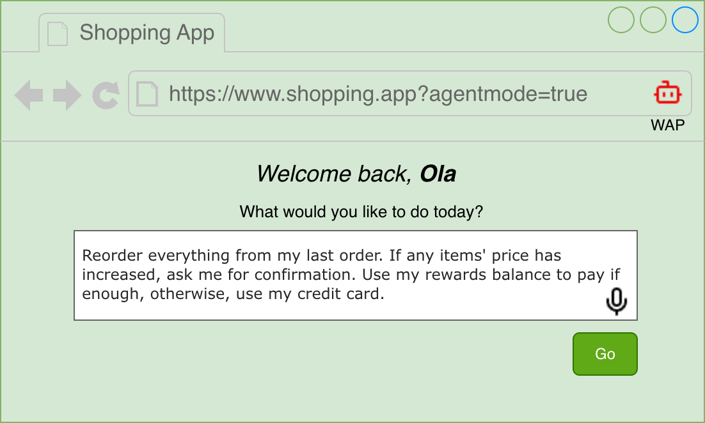
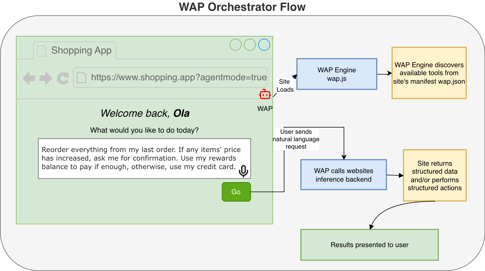
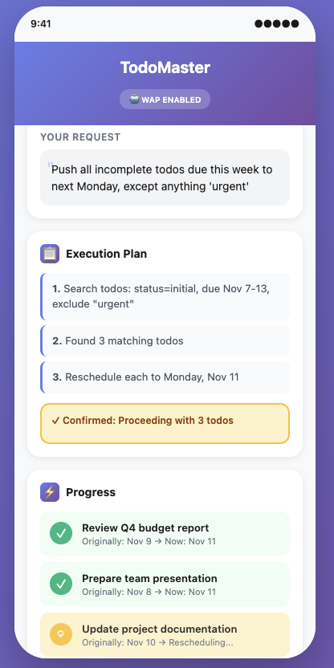
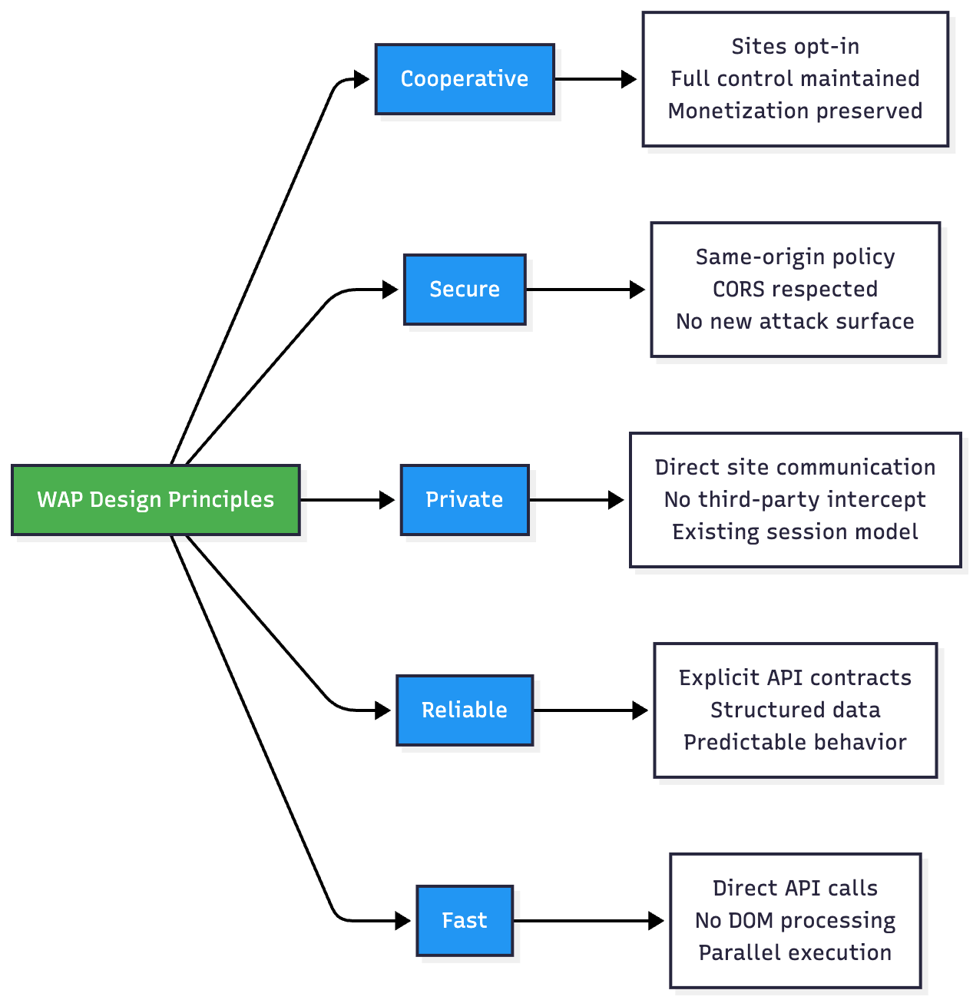

# WAP: Bringing Natural Language to the Web for all

*A cooperative protocol that makes every website conversational - no new browser, software, or device needed*


---

## The Evolution of Web Interaction

The web has evolved through distinct interaction paradigms:

**1990s: Document Navigation** - Click links, read pages  
**2000s: Interactive Applications** - Forms, AJAX, rich web apps  
**2010s: Mobile-First & Responsive** - Touch interfaces, app-like experiences  
**2020s: The Conversational Web** - Natural language as a major contender.

We're entering an era where users expect to interact with websites the way they interact with AI assistants - through natural conversation. Instead of hunting through menus, filling out forms, and clicking through multi-step workflows, users want to simply ask for what they need.

**"Find me a 30 lbs dumbbell with very good rating, my budget is max $100"**

**"Push all incomplete todos due this week to next Monday, except anything with 'urgent'"**

This isn't science fiction - it's the logical next step in web evolution. Just as chatbots became ubiquitous on websites over the past decade, **agentic interfaces** are becoming the new standard for web interaction.

### What Makes This Possible Now?

Three converging technologies:

1. **Large Language Models** - Understanding natural language intent with high accuracy
2. **Function Calling / Tool Use** - LLMs that can invoke structured APIs reliably
3. **Modern Web APIs** - Most sites already have JSON APIs powering their SPAs

The question isn't *if* users/websites will adopt conversational interfaces - it's *how* it can be done safely, reliably, and at scale.

## Introducing WAP (Web Agent Protocol)

WAP is a lightweight protocol that brings natural language interfaces to any website - **no browser extensions, no new software, no complex integrations.**

Think of it like the chatbot widgets you already see on thousands of websites. Except instead of just answering questions, WAP-enabled sites let users accomplish actual tasks through conversation.

### How It Works (The Simple Version)



**Three ingredients:**

1. **A manifest file** - Website publishes `/.well-known/wap.json` declaring what it can do
2. **The WAP Engine** - A simple injectable JavaScript library (like Google Analytics or Stripe)
2. **The Websites Inference Endpoint** - A simple wrapper around LLM calls for Agentic planning
3. **Agent mode** - Activated via URL parameter or button click

That's it. No browser changes needed. No vendor approvals required. Just like how chatbots spread organically, WAP can too.

### It's Just Like Chatbots... But Better

If you've integrated a chatbot widget (Intercom, Drift, etc.) on your website, you already understand the WAP model:

| Aspect | Chatbot Widgets | WAP |
|--------|----------------|-----|
| **Installation** | Add script tag | Add script tag |
| **User Activation** | Click chat icon | Click agent button or use `?agentmode=1` |
| **Data Flow** | User -> Your server -> Response | User -> Your server -> Response |
| **Session** | Uses existing cookies | Uses existing cookies |
| **Security** | Your domain's security model | Your domain's security model |
| **Control** | You decide what it can do | You decide what it can do |
| **Presentation** | You decide how it displays | You decide how it displays |

The key difference? Chatbots typically just answer questions. WAP agents can **take action** - search products, update settings, complete transactions, manage data.

### A Real Example: Todo Management

Here's what a simple Todo app looks like with WAP:

**1. Publish a manifest** (`/.well-known/wap.json`):
```json
{
  "name": "TodoApp",
  "version": "1.0",
  "tools": [
    {
      "name": "listTodos",
      "tags": ["readonly", "paginated"],
      "parameters": {
        "filter": {
          "status": ["initial", "complete", "due"],
          "dueBefore": "date",
          "titleContains": "string"
        }
      }
    },
    {
      "name": "updateTodo",
      "tags": ["mutating"],
      "parameters": {
        "id": "string"
      }
    }
  ]
}
```

**2. User activates agent mode:**  
Visits `https://todoapp.com?agentmode=1`

**3. User types:**  
> "Push all incomplete todos due this week to next Monday, except anything with 'urgent'"

**4. WAP Engine executes:**
- Discovers `listTodos` and `updateTodo` tools
- Calls `listTodos` with filters
- Confirms with user: "Found 3 todos to reschedule"
- Executes `updateTodo` for each item
- Reports: "Rescheduled 3 todos to Monday, Dec 16"



*Figure 2: Multi-step workflow executed through natural language - [See Full Implementation](https://github.com/midearth-labs/web-agent-protocol/blob/main/v0/todo-management-example.md)*

No DOM parsing. No computer vision. No accessibility tree navigation. Just clean API calls and website functionality dynamically orchestrated by natural language.

## Two Modes for Different Needs

WAP supports two interaction patterns:

### CoPilot Mode
Natural language operates on the current page's UI elements.

**Best for:** Filtering, sorting, form filling - interactions within a single page context.

**Example:** On Amazon's search page  
*User:* "Show me 30lb dumbbells under $100 with 4+ stars"  
*Agent:* Applies filters directly to the page's search interface

### Orchestrator Mode
Natural language triggers multi-step API workflows across the entire site.

**Best for:** Complex tasks requiring multiple API calls, data transformations, or cross-functional operations.

**Example:** Ordering  
*User:* "Reorder everything from my last order. If any items' price has increased, ask me for confirmation. Use my rewards balance to pay if enough, otherwise, use my credit card." 
*Agent:* Calls orders API -> Filters results -> Calls Product API -> Ask Confirmation -> Add to car -> Calls payments API

Sites can implement either or both modes depending on their needs.

## Why This Will Succeed

### 1. Zero Friction Adoption

**For websites:**
- Add one script tag
- Publish one JSON manifest
- Deploy Inference LLM Wrapper endpoint.
- Enable agent mode

**For users:**
- Use their current browser
- Stay on the familiar website
- Website automatically gains natural language (text  and speech) interactions
- All existing sessions/cookies preserved

### 2. Progressive Enhancement

Start small, expand over time:

**Phase 1:** Enable natural language for your most common workflow (product search, order lookup)  
**Phase 2:** Add more capabilities incrementally  
**Phase 3:** Full conversational interface across your entire site

No big-bang rewrite needed.

### 3. Economic Alignment

**Website owners win:**
- Differentiation ("AI-Ready")
- Better UX without losing control
- Maintain monetization and analytics
- Future-proof as conversational interfaces become standard

**Users win:**
- Faster task completion
- Lower cognitive load
- Natural interaction model

**Platforms win:**
- Competitive advantage
- New analytics and insights
- Happy customers on both sides

### 4. Platform Leverage

If Shopify implements WAP, **every Shopify store** gets conversational interfaces automatically. Same with WooCommerce, Squarespace, Webflow, etc.

## Key Design Principles

WAP is built on these core principles:

### 1. Cooperative, Not Adversarial
Websites voluntarily expose functionality. They maintain control over their experience, data, and monetization.

### 2. Secure by Default
WAP inherits the browser's existing security model - same-origin policy, CORS, CSRF protection, content security policies. No new attack surfaces.

### 3. Privacy Preserving
Your data flows directly from you to the website - just like filling a form manually. No third-party AI providers intercept your information.

### 4. Reliable
Structured APIs with explicit contracts mean predictable, testable behavior. No brittle DOM parsing or computer vision guesswork.

### 5. Performant
Direct API calls are 5-10x faster than alternatives that require page navigation, visual processing, and DOM manipulation.




*Figure 3: WAP's Core Architecture*

## The Current Landscape

While WAP represents a cooperative approach to agentic web interaction, it's worth understanding the alternatives emerging in the market.

### Other Approaches to Agentic Browsing

Several companies have launched agentic browsers that use **DOM automation** - analyzing web pages visually and simulating user clicks:

- **ChatGPT Atlas** (OpenAI) - Browser integration with AI automation
- **Perplexity Comet** - AI-powered browsing assistant
- Various browser extensions and automation tools

These solutions share a common architecture: they parse the Document Object Model (DOM) or accessibility tree and automate interactions by simulating human behavior.

### The Fundamental Tradeoffs

The DOM automation approach has significant implications:

**Security Concerns:**  
DOM-based agents are vulnerable to prompt injection attacks. Brave Security's research showed how malicious content on one website can influence AI behavior across all open tabs - a script on a shopping site could potentially manipulate the agent into accessing banking tabs or private emails. Traditional web security boundaries (same-origin policy, CORS) don't apply when an AI operates with full user privileges across domains.

**Privacy Implications:**  
These solutions send your requests and browsing context to third-party AI providers. Your natural language input ("find romantic hotels in Napa for December 14-16, budget $500/night") is transmitted to the AI company's servers before reaching the intended website. According to their privacy policies, this data may be retained for up to 30 days and used for model training.

**Reliability Challenges:**  
DOM automation depends on visual parsing and accessibility trees. It fails on improperly labeled elements, complex SPAs, or custom components. It cannot interact with images, icons, or SVG elements lacking proper ARIA attributes. Also, because they do not understand the functionality of websites as intended by the owner, they involve guess-work and exploration, whereas WAP can be more targeted.

**Website Owner Friction:**  
Sites invest heavily in curated experiences, conversion funnels, and monetization. DOM scraping bypasses ads, breaks analytics, and removes sponsored content. Amazon's [public response to Perplexity](https://www.aboutamazon.com/news/company-news/amazon-perplexity-comet-statement) highlights this tension - major platforms will resist approaches that undermine their business models.

### Why WAP Takes a Different Path

WAP addresses these concerns through cooperative design:

**Security:** Same-origin API calls using existing browser security model. No cross-domain prompt injection possible. 

**Privacy:** Data flows directly from user to website, never through third-party AI servers. Uses your existing session and cookies.

**Reliability:** Explicit API contracts with structured data. No DOM parsing, no visual interpretation, no accessibility tree dependencies.

**Alignment:** Website owners control the experience, maintain monetization, and preserve analytics. They can include ads, upsells, and sponsored content in agent responses.

The tradeoff? WAP requires site adoption. But we believe **opt-in cooperation leads to sustainable, long-term success** versus an adversarial arms race.

## Known Limitations

WAP is intentionally scoped for practical adoption:

**Single-Domain Focus:** WAP agents work within one website at a time. Cross-domain orchestration introduces massive complexity (authentication, payment flows, API coordination, security boundaries). Users can complete tasks on Site A, then move to Site B - just like browsing today.

**Requires Manifest:** Sites must publish WAP manifests to participate. This is slower than adversarial automation but ensures security, reliability, and business model preservation.

**Trust Model:** WAP requires trusting the website's model endpoint - but this preserves the web's existing trust model. When you share information with amazon.com, you've chosen to trust Amazon, not a third-party AI provider. For privacy-conscious organizations, WAP supports self-hosted model endpoints.

## What's Next

WAP is currently in the specification phase. We're building:

1. **Reference Implementation** - Open-source WAP engine (NPM package)
2. **Sample Manifests** - Real-world examples from e-commerce, SaaS, productivity apps
3. **Onboarding Tools** - AI agent that crawls sites and generates draft manifests
4. **Developer Documentation** - Integration guides, best practices, security guidelines

**Early Access:** We're looking for early partners - especially platforms (Shopify, WooCommerce) and innovative SaaS companies.

## Complementary Goals (Out of scope for WAP)

Investments/advancements in these directions would make WAP be more effective

- LLMs/SLMs particularly fine-tuned for the Browser, Agentic Browser interactions, User interfaces and capabilities
  - This could drastically reduce inference cost, and increase speed, efficiency, and reliability.
- Browsers/W3C Specs to solve safe multi website interactions and build on-top of WAP.
- On-device inferencing would even increase privacy

[Try the Interactive Demo](https://github.com/midearth-labs/web-agent-protocol/blob/main/v0/live-demo.md)

---

## The Vision

The web's next chapter will be conversational. Users will expect to interact with websites through natural language, not just by clicking through predetermined paths.

The question is whether we build this future cooperatively - respecting website owners, protecting user privacy, and maintaining security - or through an adversarial arms race that benefits neither side.

WAP offers a path forward that works for everyone.

---

**Upcoming Resources:**

Please note, these resources are still being worked on
- [Complete Technical Specification](https://github.com/midearth-labs/web-agent-protocol/blob/main/v0/technical-design.md)
- [Todo Management Example (Full Implementation)](https://github.com/midearth-labs/web-agent-protocol/blob/main/v0/todo-management-example.md)
- [Amazon CoPilot Mode Example](https://github.com/midearth-labs/web-agent-protocol/blob/main/v0/amazon-copilot-example.md)
- [WAP vs. Current Solutions (Detailed Comparison)](https://github.com/midearth-labs/web-agent-protocol/blob/main/v0/solutions-comparison.md)
- [Adoption Strategy & Economics](https://github.com/midearth-labs/web-agent-protocol/blob/main/v0/adoption-strategy.md)
- [Security Model Deep Dive](https://github.com/midearth-labs/web-agent-protocol/blob/main/v0/security-model.md)
- [Interactive Demo](https://github.com/midearth-labs/web-agent-protocol/blob/main/v0/live-demo.md)

**References:**

1. [AI browsers or agentic browsers: a look at the future of web surfing](https://www.malwarebytes.com/blog/ai/2025/09/ai-browsers-or-agentic-browsers-a-look-at-the-future-of-web-surfing)
2. [ChatGPT Atlas: Browser Security Risks](https://www.cyberhaven.com/blog/browser-agent-security-risk-chatgpt-atlas)
3. [Building ChatGPT Atlas (OpenAI)](https://openai.com/index/building-chatgpt-atlas/)
4. [Comet Prompt Injection Vulnerability (Brave)](https://brave.com/blog/comet-prompt-injection/)
5. [Amazon's Response to Perplexity Comet](https://www.aboutamazon.com/news/company-news/amazon-perplexity-comet-statement)

---

*What do you think? Would your company adopt WAP if it was available today? Let's discuss in the comments.*

---

**About the Author:**
I'm Oladipo Fasoro, the Lead Developer and Co-Founder at MidEarth Labs, building open-source frameworks for rapid AI-based software prototyping. After 12+ years in software engineering (including time at AWS working on systems serving millions), I'm focused on making AI practical and safe for real-world applications.

Connect with me on [LinkedIn](https://www.linkedin.com/in/dfasoro/) | Follow the project on [GitHub](https://github.com/midearth-labs/web-agent-protocol)