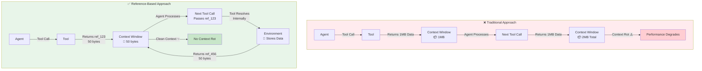

# Reference-Based Context Engineering: Moving Data Outside the LLM's Attention Budget

*How to enable AI agents to work with massive datasets with reduced context rot and hallucinations*

---

## The Context Window Paradox

Imagine an AI agent tasked with copying 50GB of data from one location to another, or analyzing a spreadsheet with millions of rows. Traditional approaches would either fail (hitting context limits) or degrade performance as the agent struggles to maintain coherence across thousands of tokens of intermediate data.

This is the fundamental challenge of **context engineering**: LLMs have finite attention budgets, and every token we add to the context window competes for that attention. As [Anthropic's research](https://www.anthropic.com/engineering/effective-context-engineering-for-ai-agents) has shown, even as context windows grow larger, we still face **context rot**—the model's ability to accurately recall information decreases as context length increases.

But here's the key insight: **the environment's memory is orders of magnitude larger than the LLM's context window**. Why are we forcing the LLM to carry all this data in its attention budget when we can simply store it outside and let the agent reference it on demand?

## Beyond Prompt Engineering: Reference-Based Context Management

In their excellent article on [effective context engineering](https://www.anthropic.com/engineering/effective-context-engineering-for-ai-agents), Anthropic outlines strategies like compaction, structured note-taking, and multi-agent architectures. These are powerful techniques, but there's a complementary approach: **reference-based data passing**.

Instead of passing large data payloads through the LLM's context window, agents pass lightweight **references** (IDs or pointers) to data stored in the environment. The LLM can retrieve raw data when needed, but doesn't carry it in its attention budget.



The agent maintains full control—it can request actual data via `retrieve_reference`—but works with lightweight references by default.

## Implementation: Pydantic Discriminated Unions

The implementation leverages Pydantic's discriminated unions to create a clean API where tools can accept either values or references transparently. Here's how it works:

```python
class ValueModel(BaseModel):
    type: Literal["value"] = "value"
    data: str

class ReferenceModel(BaseModel):
    type: Literal["reference"] = "reference"
    ref_id: str

ReferenceOrValue = Annotated[
    Union[ValueModel, ReferenceModel],
    Field(discriminator='type')
]
```

Tools accept `ReferenceOrValue` types, meaning they can work with either direct values (for small data) or references (for large data). The LLM chooses the appropriate mode based on data size and context constraints. See the [full implementation notebook](https://github.com/midearth-labs/web-agent-protocol/blob/main/v0/urs/notebooks/pass-context-references.ipynb) for complete examples.

## Real-World Benefits

### 1. Massive Data Operations

An agent can orchestrate operations on datasets that are orders of magnitude larger than the context window:

- **Data Migration**: Copy 50GB from source to destination without ever loading the data into context
- **ETL Pipelines**: Transform and move terabytes of data while the agent only sees reference IDs
- **Batch Processing**: Process millions of records where the agent coordinates the workflow but never sees the raw data

### 2. Tool Result Management

When tools return large results—like entire database query results, file contents, or API responses—these can be stored as references:

```python
# Agent calls analytical tool
result = analyze_spreadsheet(spreadsheet_id="large_file.xlsx", result_reference_id="large_file_reference_id")
# Returns: {"type": "reference", "ref_id": "large_file_reference_id"}

# Agent passes reference to visualization tool
visualize(data={"type": "reference", "ref_id": "large_file_reference_id"})
# Tool internally resolves reference, processes data, returns data or optionally new reference
```

The agent maintains full visibility and control but doesn't pay the token cost of carrying the data.

### 3. Intermediate Data Storage

Complex workflows often generate intermediate results that are only needed later. With references, these can be stored outside the context:

- **Multi-step Analysis**: Store intermediate calculations, retrieve only when needed
- **Pipeline Orchestration**: Keep transformation results between stages without context bloat
- **Error Recovery**: Maintain checkpoints and intermediate states for rollback capabilities

### 4. External Transformations

Data transformations can happen entirely outside the LLM's context window. The agent coordinates the workflow, but actual data processing happens in the environment:

- **Format Conversions**: Convert between data formats without loading into context
- **Data Validation**: Run validation rules on large datasets externally
- **Aggregations**: Compute statistics, summaries, and aggregations in the environment

## Privacy, Compliance, and PII Protection

Reference-based passing addresses critical privacy and compliance requirements for healthcare (HIPAA), finance (PCI-DSS), and other regulated industries.

**The Problem**: When sensitive data flows through an LLM's context window, PII/PHI is sent to the provider's infrastructure, may be logged or cached, and becomes difficult to audit or control.

**The Solution**: With references, sensitive data never enters the LLM's context. Agents work with opaque reference IDs (e.g., `"ref_patient_12345"`) instead of actual records. The LLM provider never sees sensitive data—only your environment does.

```python
# Instead of this (PII in context):
analyze_patient({"name": "John Doe", "ssn": "123-45-6789", "diagnosis": "X"})

# Use this (only reference ID):
analyze_patient({"type": "reference", "ref_id": "patient_record_abc123"})
```

Since data resolution happens in your environment, you can enforce RBAC, encryption, audit logging, and data minimization at the point of access. This enables HIPAA-compliant workflows where patient data remains in your infrastructure, access is logged for audits, and agents retrieve only the minimum necessary data. The architecture enforces privacy by design—impossible for sensitive data to accidentally appear in context, with explicit retrieval creating clear audit trails.

## Integration with Anthropic's Context Engineering Strategies

This approach complements rather than replaces Anthropic's techniques:

- **Compaction**: References reduce the need for compaction by keeping data out of context in the first place
- **Structured Note-Taking**: References can point to structured notes stored in the environment
- **Multi-Agent Architectures**: Sub-agents can pass references to each other, maintaining clean context windows while sharing data

As Anthropic notes in their [code execution with MCP article](https://www.anthropic.com/engineering/code-execution-with-mcp), the Model Context Protocol enables rich interactions between agents and their environment. Reference-based passing extends this by making data exchange token-efficient.

## Future Possibilities

The reference-based approach opens up several exciting directions:

### 1. Lazy Evaluation

References could enable lazy evaluation patterns where tool calls aren't executed until the data is actually needed. The agent could build up a dependency graph of references, and the environment could optimize execution order or skip unnecessary operations entirely.

### 2. JSONPath and Deterministic Transformations

For structured data like JSON, exposing JSONPath capabilities via transformer tools could move many deterministic transformations outside the LLM. The agent could specify transformations declaratively:

```python
jsonpath(
    source={"type": "reference", "ref_id": "data_123"},
    path="$.users[*].email"
)
```

This keeps the LLM focused on orchestration while deterministic operations happen efficiently in the environment.

### 3. Backtracking and Transaction Management

References enable powerful state management patterns:

- **Exploration**: Agents can explore different paths, storing intermediate states as references, and backtrack when needed
- **Transactions**: Reference-based operations can be wrapped in transactions, with rollback capabilities
- **Checkpointing**: Save agent state at key decision points, enabling recovery and continuation

### 4. Batch Execution

A particularly interesting possibility: the agent could build up a graph of operations using references, and the environment could execute the entire graph in one optimized batch operation. This combines the flexibility of agentic orchestration with the efficiency of batch processing.

## The Path Forward

Context engineering is evolving from prompt optimization to holistic context management. As [Anthropic's research](https://claude.com/blog/context-management) shows, treating context as a finite, precious resource is essential for building capable agents.

Reference-based data passing represents a natural extension of this thinking: if the environment can store data more efficiently than the LLM can, why not leverage that? The agent maintains full control and visibility—it can always retrieve the raw data—but it doesn't have to pay the attention cost of carrying it around.

This approach is particularly powerful for:
- **Data-intensive workflows**: ETL, migration, analysis
- **Long-running agents**: Operations that span hours or days
- **Multi-step processes**: Complex pipelines with many intermediate states
- **Resource-constrained scenarios**: When token costs or context limits are concerns
- **Privacy-sensitive applications**: Healthcare (HIPAA), finance (PCI-DSS), and other regulated industries where PII/PHI must remain in controlled environments

The implementation is straightforward—using Pydantic discriminated unions, we can create tools that transparently support both value and reference modes. The LLM naturally learns to use references for large data and values for small data, optimizing its own context usage.

For a complete working example with Google Gemini, see this [implementation notebook](https://github.com/midearth-labs/web-agent-protocol/blob/main/v0/urs/notebooks/pass-context-references.ipynb).

## Conclusion

As AI agents tackle increasingly complex and data-intensive tasks, context engineering becomes critical. Reference-based data passing offers a practical way to scale agent capabilities without hitting context limits or suffering from context rot.

The key insight is simple: **the environment is the agent's extended memory**. By storing data outside the LLM's attention budget and passing lightweight references instead, we enable agents to work with datasets of any size while maintaining the flexibility and control that makes agents powerful.

This isn't a replacement for careful prompt engineering, compaction, or structured note-taking—it's a complementary technique that addresses a fundamental constraint: the finite nature of attention. As we build more capable agents, techniques like this will be essential for scaling to real-world problems.

---

*For more on context engineering, see Anthropic's excellent resources:*
- *[Effective Context Engineering for AI Agents](https://www.anthropic.com/engineering/effective-context-engineering-for-ai-agents)*
- *[Context Management](https://claude.com/blog/context-management)*
- *[Code Execution with MCP](https://www.anthropic.com/engineering/code-execution-with-mcp)*

