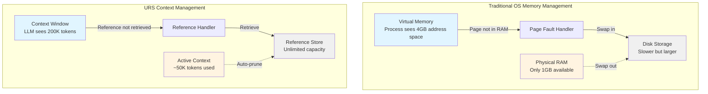
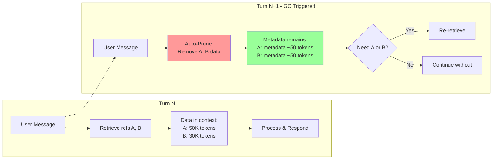
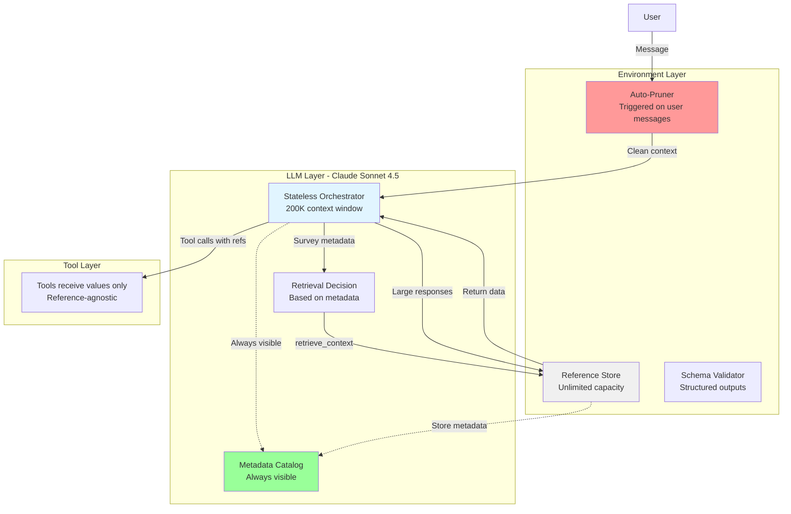
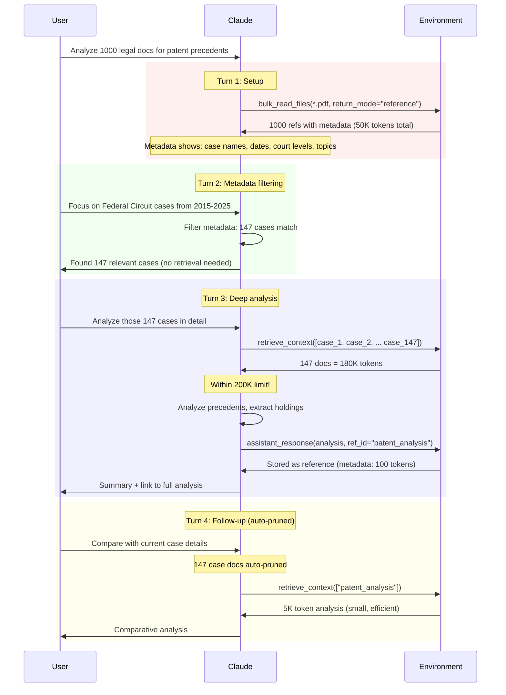

# Unified Reference System: Memory Management for Large Language Models

**A bidirectional reference architecture enabling stateless LLMs to efficiently manage context windows through garbage collection-inspired memory management**

*Reading time: 5 minutes*

---

## Executive Summary

The Unified Reference System (URS) applies classical computer science memory management principles to solve the context window problem in Large Language Models. Like how operating systems manage RAM through paging and virtual memory, URS manages LLM context through lightweight references and just-in-time retrieval, enabling Claude Sonnet 4.5 to work with terabytes of data within its 200K token context window.

**Key Innovation**: Bidirectional reference passing where both environment→LLM (data files) and LLM→environment (assistant outputs) are managed through the same memory system, with automatic garbage collection between conversational turns.

---

## The Problem: Context Window Exhaustion

Claude Sonnet 4.5 has a 200K token context window (~680,000 characters or 500 pages). When building agentic workflows, this fills rapidly:

- **Large datasets**: A 50MB CSV file = ~12.5M tokens (62x context limit)
- **Multi-file codebases**: 100 Python files × 500 lines each = ~300K tokens
- **Long conversations**: 20 turns × 5K tokens per response = 100K tokens
- **Agent outputs**: Comprehensive reports, documentation, analysis results

Traditional approaches fail:
- **Naive loading**: Crash on first large file
- **Selective loading**: Manual complexity, brittle logic
- **Summarization**: Lossy, cannot regenerate original
- **External databases**: Breaking LLM statelessness, added latency

---

## Computer Science Parallels

### Virtual Memory & Paging



**Analogy**: 
- Virtual memory = Full conversation history with references
- Physical RAM = Active context window (200K tokens)
- Page table = Reference metadata catalog
- Page fault = `retrieve_context()` call
- Swap out = Auto-pruning on turn boundary

### JVM Garbage Collection

URS implements a **generational garbage collection** strategy similar to JVM's G1GC:

| JVM Concept | URS Equivalent | Trigger |
|-------------|----------------|---------|
| Young Generation | Current turn data | Auto-prune on user message |
| Old Generation | Reference metadata | Never pruned (permanent) |
| Eden Space | Newly retrieved data | Pruned if not re-requested |
| Full GC | Manual `retrieve_context` | Explicit user need |
| Mark & Sweep | Metadata survives, data pruned | Turn boundary |



### Database Query Optimization

URS's just-in-time retrieval mirrors database query planning:

```sql
-- Traditional approach: Load everything
SELECT * FROM huge_table;  -- Loads 10M rows into memory

-- URS approach: Metadata-driven decisions
EXPLAIN SELECT COUNT(*), AVG(price) FROM huge_table;  -- Metadata query
-- Returns: 10M rows, avg: $45.50, no data loaded

-- Only retrieve when necessary
SELECT * FROM huge_table WHERE category = 'electronics' LIMIT 10;
```

---

## Architecture: Bidirectional Reference System

### Core Components



### Bidirectional Flow

**Direction 1: Environment → LLM (Data Files)**
```
1. Tool creates reference: read_file("data.csv", return_mode="reference", ref_id="sales_2024")
2. Environment stores 50MB file, returns metadata (~50 tokens)
3. LLM decides: Can I answer from metadata? → No
4. LLM requests: retrieve_context(["sales_2024"])
5. Environment injects 12.5M tokens into context
6. Next user message → Auto-prune removes data, keeps metadata
```

**Direction 2: LLM → Environment (Assistant Outputs)**
```
1. LLM generates large report (5K tokens)
2. LLM decides: This should be a reference (user may ask follow-ups)
3. LLM calls: assistant_response(content={value: report}, ref_id="market_analysis_q1")
4. Environment stores report, returns metadata (~100 tokens)
5. User sees: Summary + download link
6. Follow-up question → LLM retrieves report if needed
```

---

## Implementation with Claude Sonnet 4.5

### Structured Outputs for Metadata

Claude Sonnet 4.5's structured output feature (`anthropic-beta: structured-outputs-2025-11-13`) guarantees schema-compliant metadata:

```python
from anthropic import Anthropic
import json

client = Anthropic(api_key="...")

# Define metadata schema for references
ReferenceMetadata = {
    "type": "object",
    "properties": {
        "reference": {"type": "string"},
        "data_type": {"type": "string", "enum": ["csv", "json", "image", "code", "document"]},
        "size_bytes": {"type": "integer"},
        "row_count": {"type": "integer"},
        "summary": {"type": "string"},
        "key_entities": {
            "type": "array",
            "items": {"type": "string"}
        },
        "sample_data": {"type": "string"}
    },
    "required": ["reference", "data_type", "size_bytes", "summary"],
    "additionalProperties": False
}

# Tool definition with strict schema
tools = [
    {
        "name": "read_file",
        "description": "Read a file and return as reference",
        "input_schema": {
            "type": "object",
            "properties": {
                "filepath": {"type": "string"},
                "return_mode": {"type": "string", "enum": ["value", "reference"]},
                "ref_id": {"type": "string"}
            },
            "required": ["filepath", "return_mode"]
        },
        "strict": True  # Guaranteed schema compliance
    },
    {
        "name": "retrieve_context",
        "description": "Retrieve full data for references",
        "input_schema": {
            "type": "object",
            "properties": {
                "ref_ids": {
                    "type": "array",
                    "items": {"type": "string"}
                }
            },
            "required": ["ref_ids"]
        },
        "strict": True
    },
    {
        "name": "assistant_response",
        "description": "Store large assistant output as reference",
        "input_schema": {
            "type": "object",
            "properties": {
                "content": {"type": "string"},
                "ref_id": {"type": "string"},
                "metadata": {
                    "type": "object",
                    "properties": {
                        "type": {"type": "string", "enum": ["report", "code", "analysis", "document"]},
                        "summary": {"type": "string"},
                        "key_points": {
                            "type": "array",
                            "items": {"type": "string"}
                        }
                    },
                    "required": ["type", "summary"]
                }
            },
            "required": ["content", "ref_id", "metadata"]
        },
        "strict": True
    }
]
```

### Auto-Pruning Implementation

```python
class ConversationManager:
    def __init__(self):
        self.reference_store = {}  # Unlimited storage
        self.metadata_catalog = {}  # Always in context
        
    def process_turn(self, user_message, conversation_history):
        # STEP 1: Auto-prune retrieved data
        pruned_history = self._prune_retrieved_data(conversation_history)
        
        # STEP 2: Build context with metadata catalog
        context = self._build_context(pruned_history, self.metadata_catalog)
        
        # STEP 3: Send to Claude (< 200K tokens)
        response = client.messages.create(
            model="claude-sonnet-4-5-20250929",
            max_tokens=8000,
            messages=context + [{"role": "user", "content": user_message}],
            tools=tools
        )
        
        return response
    
    def _prune_retrieved_data(self, history):
        """Remove retrieve_context calls and their data responses"""
        pruned = []
        skip_next = False
        
        for msg in history:
            if skip_next:
                skip_next = False
                continue
                
            if self._is_retrieve_call(msg):
                skip_next = True  # Skip the data response too
                continue
                
            pruned.append(msg)
        
        return pruned
    
    def _build_context(self, history, metadata):
        """Inject metadata catalog as always-visible system context"""
        metadata_prompt = self._format_metadata_catalog(metadata)
        
        return [
            {"role": "system", "content": f"Available references:\n{metadata_prompt}"},
            *history
        ]
    
    def _format_metadata_catalog(self, metadata):
        """Format metadata for efficient token usage"""
        catalog = []
        for ref_id, meta in metadata.items():
            catalog.append(f"- {ref_id}: {meta['data_type']}, "
                          f"{meta['size_bytes']:,} bytes, "
                          f"{meta['summary']}")
        return "\n".join(catalog)
```

### Token Efficiency Example

**Scenario**: Analyzing 5 CSV files (250MB total)

**Without URS**:
```
Initial load: 250MB × 2,500 tokens/MB = 625,000 tokens
Status: ❌ CRASH (exceeds 200K limit by 3x)
```

**With URS**:
```
Turn 1: Load all files as references
- 5 files × 50 tokens metadata = 250 tokens
- Status: ✅ 0.125% of context used

Turn 2: "Count records in each file"
- Metadata has row_count fields
- No retrieval needed
- Response: 250 tokens (metadata only)
- Status: ✅ 0.25% of context used

Turn 3: "Show top 10 products by revenue"
- retrieve_context(["sales_2024"])  # Only 1 file needed
- 50MB × 2,500 = 125,000 tokens
- Status: ✅ 62.5% of context used (within limit)

Turn 4: "Now analyze customer demographics"
- Auto-prune: sales_2024 data removed
- retrieve_context(["customers_2024"])
- 40MB × 2,500 = 100,000 tokens
- Status: ✅ 50% of context used

Total operations: 4 analyses across 250MB dataset
Peak context usage: 62.5% (125K/200K tokens)
Without URS: Would crash on initial load
```

---

## Real-World Use Case: Document Analysis Pipeline

### Scenario
A legal firm needs Claude to analyze 1,000 court documents (2GB total) to find precedents for a current case.

### Traditional Approach
```
Load all documents → CRASH (2GB = 5M tokens vs 200K limit)
```

### URS Approach



**Results**:
- Processed 2GB of documents within 200K context window
- 4 conversational turns
- Peak context: 180K tokens (90% utilization)
- Zero crashes, zero manual memory management

---

## Advanced Pattern: Generational Caching

Inspired by CPU caches (L1/L2/L3), URS can implement tiered retrieval:

```python
class TieredReferenceSystem:
    def __init__(self):
        self.l1_cache = {}  # Hot data (current turn) - in context
        self.l2_cache = {}  # Warm data (recent turns) - metadata only
        self.l3_store = {}  # Cold data (old turns) - full pruned
        
    def retrieve_with_promotion(self, ref_id):
        """
        Promote frequently accessed references through cache tiers
        Similar to cache line promotion in CPU caches
        """
        if ref_id in self.l1_cache:
            # Already in context, no-op
            return self.l1_cache[ref_id]
        
        if ref_id in self.l2_cache:
            # Recent access, promote to L1
            data = self.l3_store[ref_id]
            self.l1_cache[ref_id] = data
            return data
        
        # Cold start, load from store
        data = self.l3_store[ref_id]
        self.l2_cache[ref_id] = self.get_metadata(ref_id)
        self.l1_cache[ref_id] = data
        return data
```

---

## Performance Characteristics

### Time Complexity

| Operation | Without URS | With URS |
|-----------|-------------|----------|
| Load 100MB file | O(n) - crashes if > 200K tokens | O(1) - metadata only (~50 tokens) |
| Pass file to tool | O(n) - full data in context | O(1) - reference pointer |
| Switch contexts | O(n) - manual cleanup | O(1) - auto-prune |
| Multi-file analysis | O(n×m) - all files in context | O(k) - only needed files, k < n |

### Space Complexity

| Scenario | Context Usage Without URS | Context Usage With URS |
|----------|---------------------------|------------------------|
| 10 CSV files (500MB) | 1.25M tokens (❌ crash) | 500 tokens metadata |
| 50 code files (2.5MB) | 150K tokens | 2.5K tokens metadata |
| 20-turn conversation | 100K tokens (cumulative) | 5K tokens (auto-pruned) |
| Large assistant report | 5K tokens per turn × 10 = 50K | 100 tokens metadata × 10 = 1K |

---

## Implementation Checklist

Building URS requires:

✅ **Reference Store**: Persistent key-value store (Redis, S3, filesystem)  
✅ **Metadata Extractor**: Generate summaries, samples, schemas from data  
✅ **Auto-Pruner**: Middleware that intercepts user messages  
✅ **Retrieval Handler**: Batch fetch multiple references efficiently  
✅ **Tool Adapter**: Convert references to values before tool execution  
✅ **Structured Output Schemas**: Define metadata formats with Claude's structured outputs  
✅ **Context Monitor**: Track token usage, warn on approaching limits  

---

## Conclusion

The Unified Reference System demonstrates that classical CS memory management principles—virtual memory, garbage collection, caching—translate effectively to LLM context management. By treating the context window as a scarce resource (like RAM) and implementing bidirectional reference passing with automatic garbage collection, we enable Claude Sonnet 4.5 to work with effectively unlimited data while staying within its 200K token limit.

**Key Takeaway**: The future of agentic AI isn't just smarter models—it's smarter memory architectures that let models work with human-scale data within machine-scale constraints.

---

## References

- [Claude Sonnet 4.5 Documentation](https://docs.claude.com/en/docs/about-claude/models/overview)
- [Structured Outputs API](https://docs.claude.com/en/docs/build-with-claude/structured-outputs)
- [Context Window Limits](https://support.claude.com/en/articles/7996856-what-is-the-maximum-prompt-length)
- Virtual Memory (Tanenbaum, Modern Operating Systems)
- Garbage Collection (Jones & Lins, The Garbage Collection Handbook)
- Database Query Optimization (Ramakrishnan & Gehrke, Database Management Systems)